# SURF the TAsk Class Object Sequence Diagrams

**Source:** `docs/Analysis_22212069_박성준.md`, `images/ClassDiagram.png`  
**Related Document:** `docs/Sequence_Diagrams_22212069_박성준.md`  
**Purpose:** Class Diagram의 객체와 메서드 기준으로 Use Case 흐름을 정리한 Sequence Diagram  
**Last Update:** 2026-06-01

---

## 작성 기준

- UI, Controller, Repository, Database는 생략하고 Class Diagram의 객체 간 협력만 표현한다.
- 참여자는 `objectName:ClassName` 형식으로 작성한다.
- 메시지는 Class Diagram에 정의된 메서드명을 기준으로 작성한다.
- getter/setter는 흐름상 의미가 큰 경우만 표시한다.
- 저장, 조회, 화면 이동은 구현 계층의 책임이므로 도메인 객체 상태 변경과 서비스 호출을 중심으로 표현한다.

---

## UC-01 Register

### UC-01 Main - 회원가입 성공

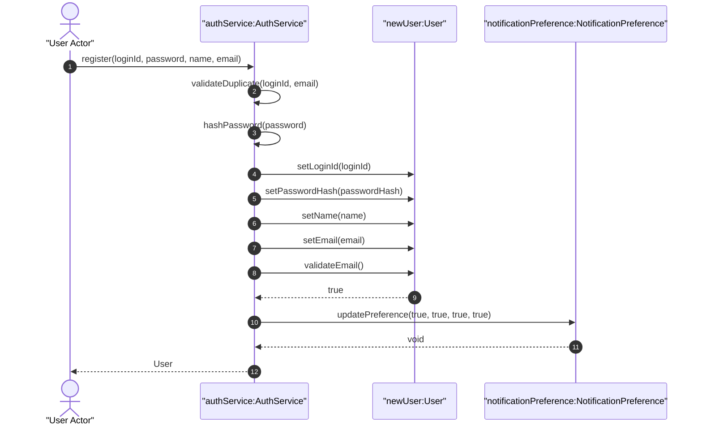

### UC-01-E1 - 필수 정보 또는 이메일 형식 오류

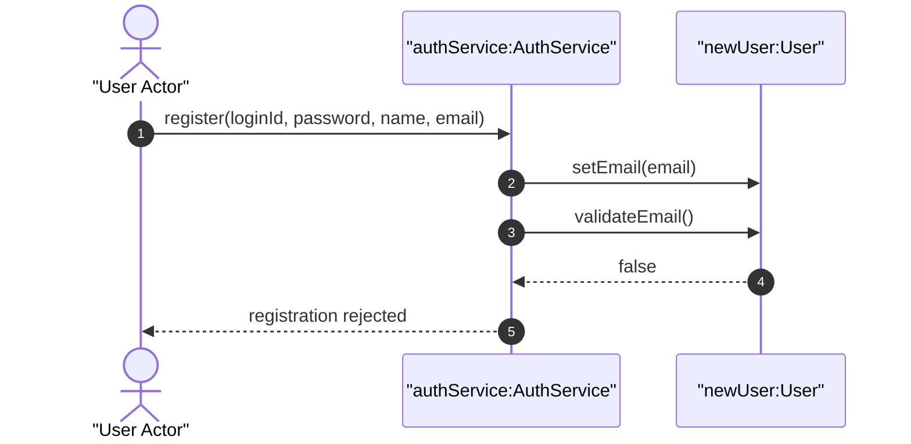

### UC-01-E2 - ID 또는 이메일 중복

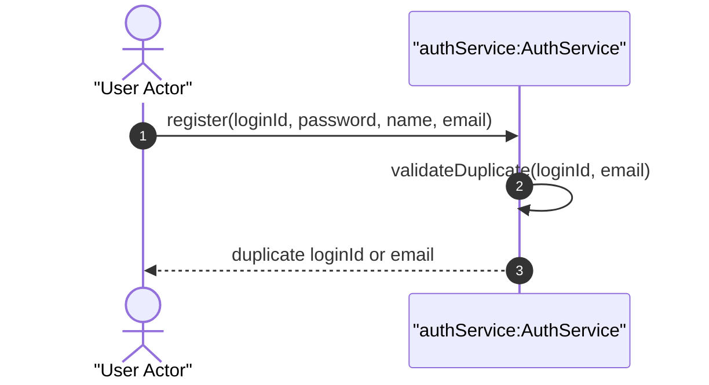

---

## UC-02 Log In

### UC-02 Main - 로그인 성공

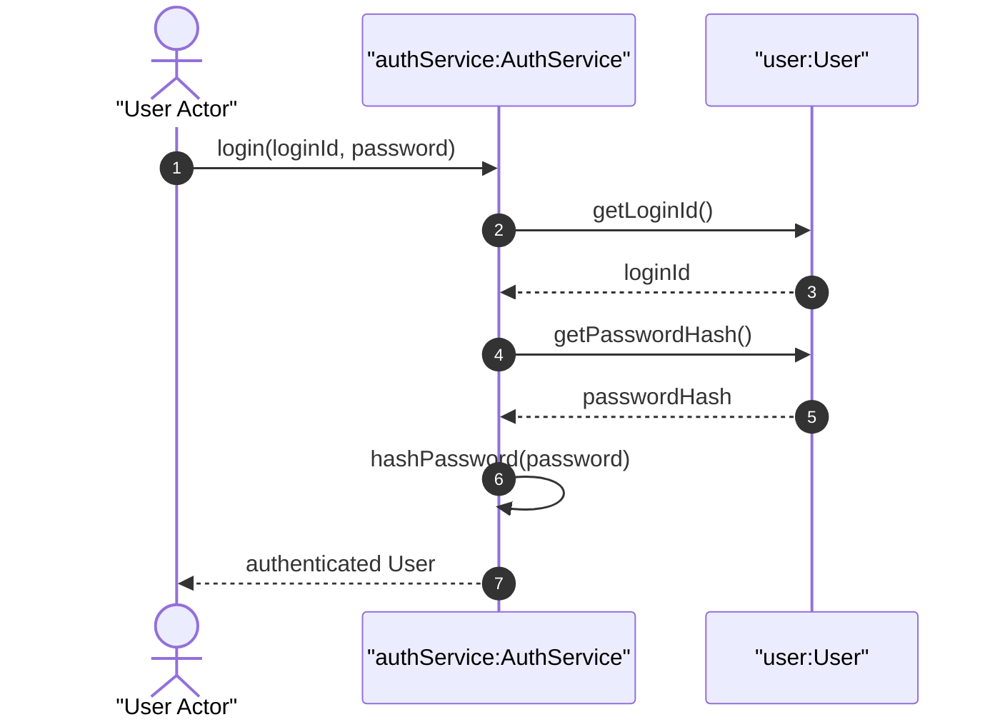

### UC-02-E1 - 등록되지 않은 사용자 또는 비밀번호 불일치

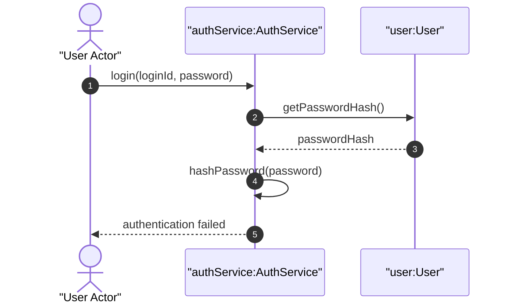

### UC-02-E2 - 로그아웃

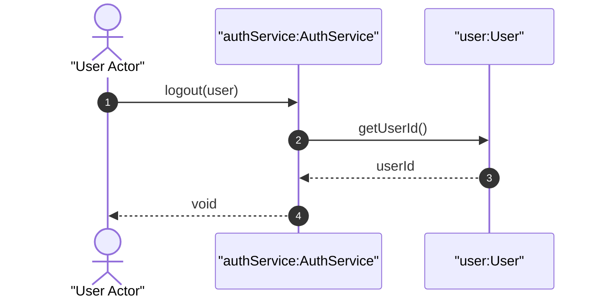

---

## UC-03 Register Personal Schedule

### UC-03 Main - 개인 시간표 등록 및 가용 시간 계산 성공

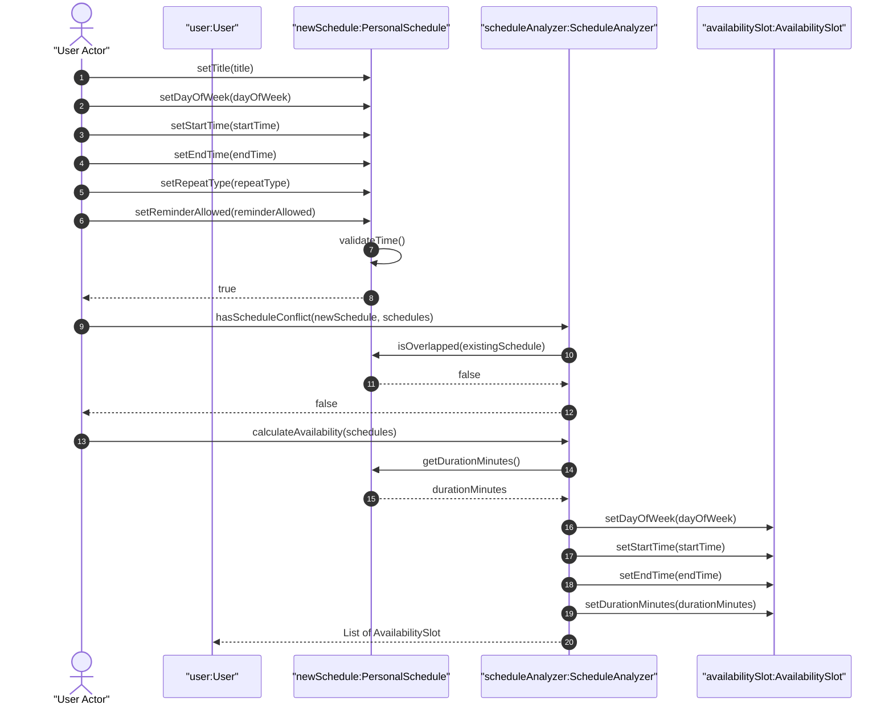

### UC-03-E1 - 시간 범위 오류

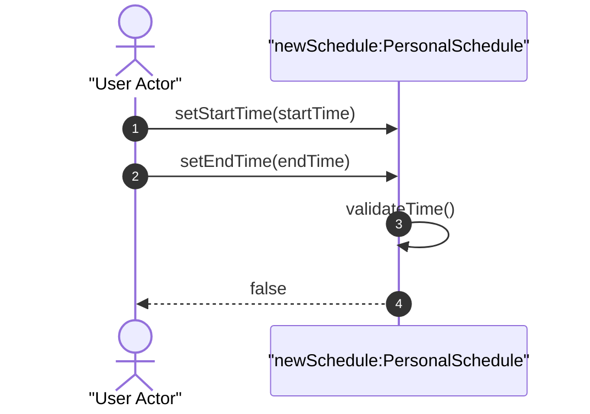

### UC-03-E2 - 기존 일정과 충돌

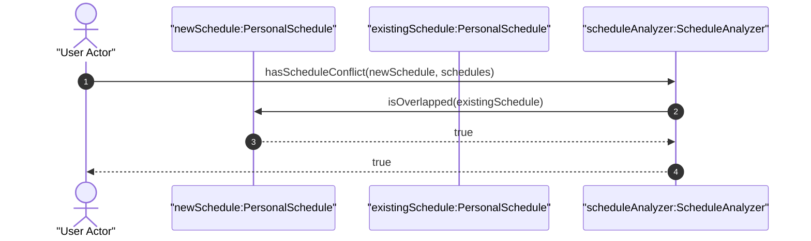

---

## UC-04 Register Daily Goal

### UC-04 Main - Daily Goal 등록 성공

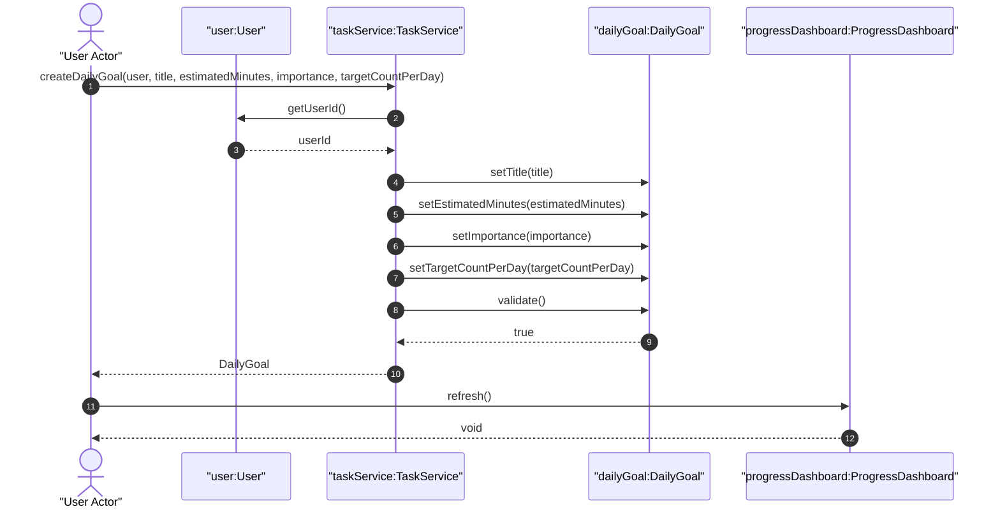

### UC-04-E1 - Daily Goal 입력값 오류

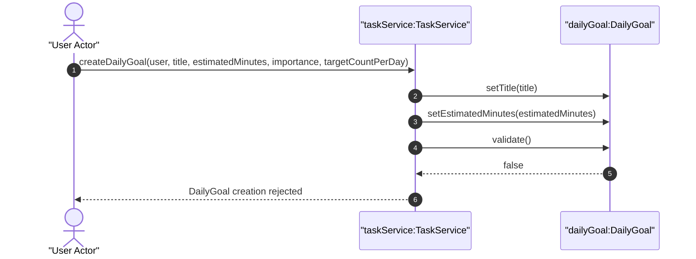

---

## UC-05 Register Deadline Task

### UC-05 Main - Deadline Task 등록 성공

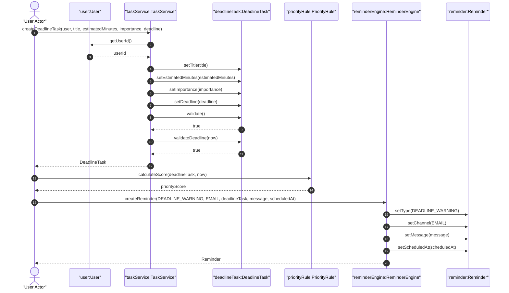

### UC-05-E1 - 마감일 오류

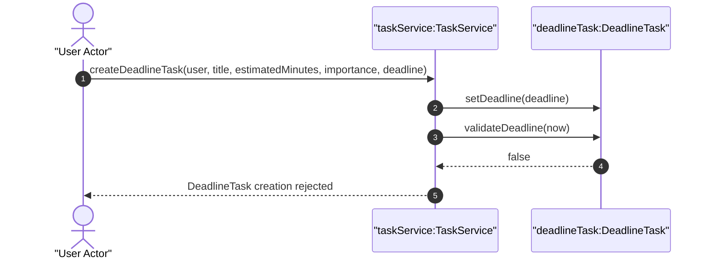

---

## UC-06 Check Task Completion

### UC-06 Main - 완료 체크 성공

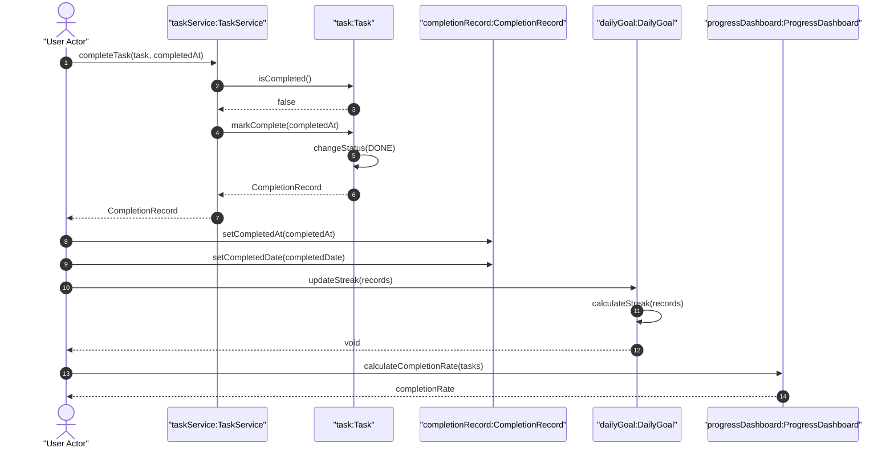

### UC-06-E1 - 이미 완료된 항목 확인

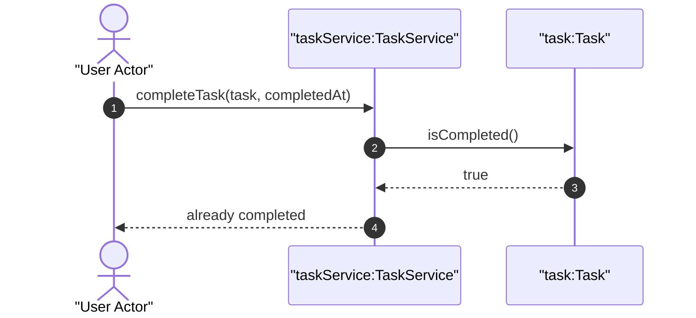

### UC-06-E2 - 완료 취소

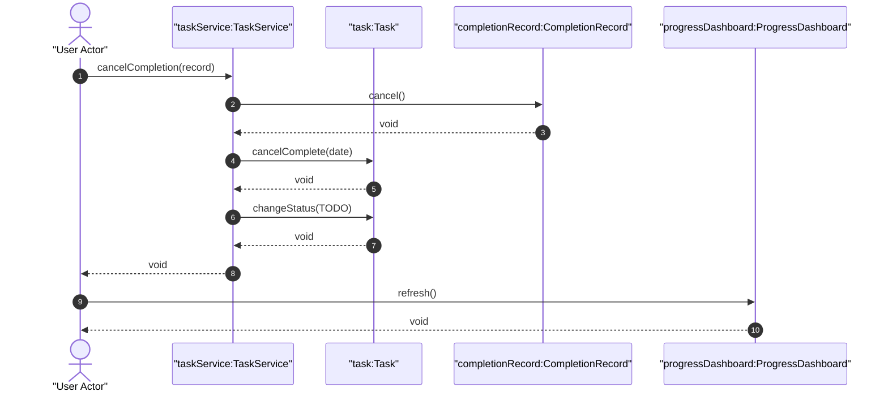

---

## UC-07 Edit Item

### UC-07 Main - 항목 수정 성공

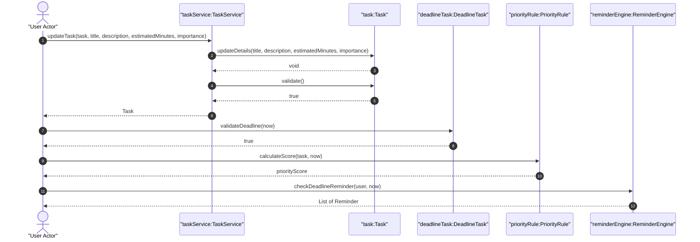

### UC-07-E1 - 수정 입력값 오류

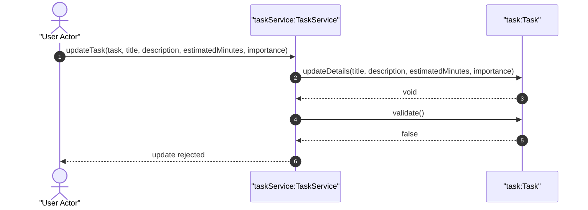

---

## UC-08 Delete Item

### UC-08 Main - 항목 삭제 성공

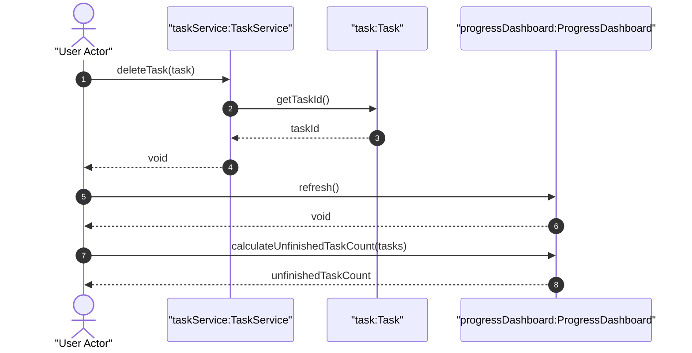

### UC-08-E1 - 삭제 취소

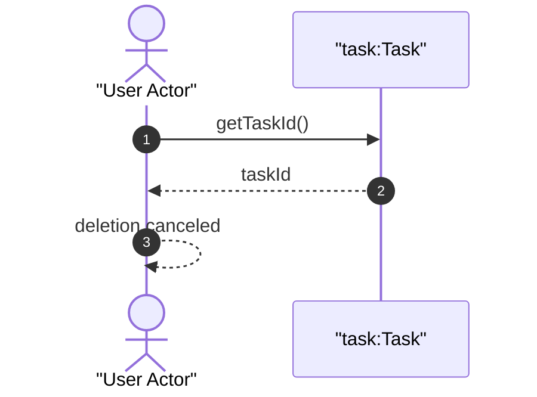

---

## UC-09 Turn On Focus Mode

### UC-09 Main - 집중 모드 시작 성공

```mermaid
sequenceDiagram
    autonumber
    actor UserActor as "User Actor"
    participant FSvc as "focusService:FocusService"
    participant U as "user:User"
    participant T as "task:Task"
    participant FS as "focusSession:FocusSession"

    UserActor->>FSvc: startFocus(user, task)
    FSvc->>FSvc: validateSingleActiveSession(user)
    FSvc-->>FSvc: true
    FSvc->>T: canStartFocus()
    T-->>FSvc: true
    FSvc->>T: changeStatus(IN_PROGRESS)
    T-->>FSvc: void
    FSvc->>FS: start()
    FS-->>FSvc: void
    FSvc-->>UserActor: FocusSession
    UserActor->>FS: isActive()
    FS-->>UserActor: true
```

### UC-09-E1 - 활성 Focus Session 존재

```mermaid
sequenceDiagram
    autonumber
    actor UserActor as "User Actor"
    participant FSvc as "focusService:FocusService"
    participant U as "user:User"

    UserActor->>FSvc: startFocus(user, task)
    FSvc->>FSvc: validateSingleActiveSession(user)
    FSvc-->>UserActor: false
```

### UC-09-E2 - 완료된 항목은 집중 시작 불가

```mermaid
sequenceDiagram
    autonumber
    actor UserActor as "User Actor"
    participant FSvc as "focusService:FocusService"
    participant T as "task:Task"

    UserActor->>FSvc: startFocus(user, task)
    FSvc->>T: canStartFocus()
    T-->>FSvc: false
    FSvc-->>UserActor: focus start rejected
```

---

## UC-10 Turn Off Focus Mode

### UC-10 Main - 실제 종료 선택 후 집중 모드 종료

```mermaid
sequenceDiagram
    autonumber
    actor UserActor as "User Actor"
    participant FSvc as "focusService:FocusService"
    participant FS as "focusSession:FocusSession"
    participant T as "task:Task"
    participant CR as "completionRecord:CompletionRecord"

    UserActor->>FSvc: finishFocus(session, true, true)
    FSvc->>FS: finish(true)
    FS-->>FSvc: void
    FSvc->>T: changeStatus(DONE)
    T-->>FSvc: void
    FSvc->>T: markComplete(completedAt)
    T-->>FSvc: CompletionRecord
    FSvc-->>UserActor: void
    UserActor->>CR: getCompletedAt()
    CR-->>UserActor: completedAt
```

### UC-10-E1 - 실제 종료가 아니므로 지연 알림 예약

```mermaid
sequenceDiagram
    autonumber
    actor UserActor as "User Actor"
    participant FSvc as "focusService:FocusService"
    participant FS as "focusSession:FocusSession"
    participant RE as "reminderEngine:ReminderEngine"
    participant R as "reminder:Reminder"

    UserActor->>FSvc: finishFocus(session, false, false)
    FSvc->>FS: keepActive()
    FS-->>FSvc: void
    FSvc->>FSvc: scheduleDelayedAlert(session)
    FSvc->>RE: createReminder(DELAYED_IN_SITE, IN_SITE, task, message, scheduledAt)
    RE->>R: setType(DELAYED_IN_SITE)
    RE->>R: setChannel(IN_SITE)
    RE->>R: setScheduledAt(scheduledAt)
    RE-->>FSvc: Reminder
    FSvc-->>UserActor: Reminder
```

### UC-10-E2 - 완료 처리 없이 집중 모드만 종료

```mermaid
sequenceDiagram
    autonumber
    actor UserActor as "User Actor"
    participant FSvc as "focusService:FocusService"
    participant FS as "focusSession:FocusSession"
    participant T as "task:Task"

    UserActor->>FSvc: finishFocus(session, true, false)
    FSvc->>FS: finish(true)
    FS-->>FSvc: void
    FSvc->>T: changeStatus(TODO)
    T-->>FSvc: void
    FSvc-->>UserActor: void
```

---

## UC-11 Prioritize Tasks

### UC-11 Main - 업무 우선순위 확인

```mermaid
sequenceDiagram
    autonumber
    actor UserActor as "User Actor"
    participant TS as "taskService:TaskService"
    participant U as "user:User"
    participant PR as "priorityRule:PriorityRule"
    participant T1 as "taskA:Task"
    participant T2 as "taskB:Task"

    UserActor->>TS: getIncompleteTasks(user)
    TS->>U: getUserId()
    U-->>TS: userId
    TS-->>UserActor: List of Task
    UserActor->>PR: calculateScore(taskA, now)
    PR-->>UserActor: scoreA
    UserActor->>PR: calculateScore(taskB, now)
    PR-->>UserActor: scoreB
    UserActor->>PR: compare(taskA, taskB)
    PR-->>UserActor: compareResult
    UserActor->>PR: sortTasks(tasks)
    PR-->>UserActor: sortedTasks
```

### UC-11-E1 - 미완료 항목 없음

```mermaid
sequenceDiagram
    autonumber
    actor UserActor as "User Actor"
    participant TS as "taskService:TaskService"
    participant U as "user:User"

    UserActor->>TS: getIncompleteTasks(user)
    TS->>U: getUserId()
    U-->>TS: userId
    TS-->>UserActor: empty List of Task
```

---

## UC-12 Review Progress

### UC-12 Main - 진행 현황 확인 성공

```mermaid
sequenceDiagram
    autonumber
    actor UserActor as "User Actor"
    participant PD as "progressDashboard:ProgressDashboard"
    participant DG as "dailyGoal:DailyGoal"
    participant PR as "priorityRule:PriorityRule"

    UserActor->>PD: calculateCompletionRate(tasks)
    PD-->>UserActor: completionRate
    UserActor->>PD: calculateUnfinishedTaskCount(tasks)
    PD-->>UserActor: unfinishedTaskCount
    UserActor->>DG: calculateStreak(records)
    DG-->>UserActor: streakCount
    UserActor->>DG: updateStreak(records)
    DG-->>UserActor: void
    UserActor->>PD: calculateMaxStreak(goals)
    PD-->>UserActor: maxStreak
    UserActor->>PD: buildPrioritySummary(tasks)
    PD->>PR: sortTasks(tasks)
    PR-->>PD: sortedTasks
    PD-->>UserActor: prioritySummary
    UserActor->>PD: refresh()
    PD-->>UserActor: void
```

### UC-12-E1 - 완료 기록 없음

```mermaid
sequenceDiagram
    autonumber
    actor UserActor as "User Actor"
    participant PD as "progressDashboard:ProgressDashboard"
    participant DG as "dailyGoal:DailyGoal"

    UserActor->>DG: isCompletedOn(date, records)
    DG-->>UserActor: false
    UserActor->>PD: calculateCompletionRate(tasks)
    PD-->>UserActor: 0.0
    UserActor->>PD: calculateUnfinishedTaskCount(tasks)
    PD-->>UserActor: unfinishedTaskCount
```

---

## UC-13 Send Availability-based Reminder

### UC-13 Main - 가용 시간 기반 이메일 알림 전송 성공

```mermaid
sequenceDiagram
    autonumber
    actor Scheduler
    participant RE as "reminderEngine:ReminderEngine"
    participant SA as "scheduleAnalyzer:ScheduleAnalyzer"
    participant Slot as "availabilitySlot:AvailabilitySlot"
    participant TS as "taskService:TaskService"
    participant NP as "notificationPreference:NotificationPreference"
    participant R as "reminder:Reminder"
    participant RH as "reminderHistory:ReminderHistory"

    Scheduler->>RE: checkAvailabilityReminder(user, now)
    RE->>SA: isAvailable(now, slots)
    SA->>Slot: contains(now)
    Slot-->>SA: true
    SA-->>RE: true
    RE->>TS: getIncompleteTasks(user)
    TS-->>RE: List of Task
    RE->>Slot: isEnoughFor(task)
    Slot-->>RE: true
    RE->>RE: createReminder(AVAILABILITY_BASED, EMAIL, task, message, scheduledAt)
    RE-->>R: Reminder
    RE->>NP: canSend(EMAIL, AVAILABILITY_BASED)
    NP-->>RE: true
    RE->>RE: shouldSend(user, reminder)
    RE-->>RE: true
    RE->>RE: sendReminder(reminder)
    RE-->>RE: true
    RE->>R: markSent(now)
    R-->>RE: void
    RE->>RE: recordResult(reminder, SENT, "")
    RE-->>RH: ReminderHistory
    RH->>RH: recordSuccess()
    RH-->>Scheduler: void
```

### UC-13-E1 - 현재 시간이 가용 시간이 아님

```mermaid
sequenceDiagram
    autonumber
    actor Scheduler
    participant RE as "reminderEngine:ReminderEngine"
    participant SA as "scheduleAnalyzer:ScheduleAnalyzer"
    participant R as "reminder:Reminder"
    participant RH as "reminderHistory:ReminderHistory"

    Scheduler->>RE: checkAvailabilityReminder(user, now)
    RE->>SA: isAvailable(now, slots)
    SA-->>RE: false
    RE->>RE: createReminder(AVAILABILITY_BASED, EMAIL, task, message, scheduledAt)
    RE-->>R: Reminder
    RE->>R: markSkipped("NOT_AVAILABLE_TIME")
    R-->>RE: void
    RE->>RE: recordResult(reminder, SKIPPED, "NOT_AVAILABLE_TIME")
    RE-->>RH: ReminderHistory
    RH->>RH: recordSkipped("NOT_AVAILABLE_TIME")
```

### UC-13-E2 - 알림 비허용 또는 중복 알림

```mermaid
sequenceDiagram
    autonumber
    actor Scheduler
    participant RE as "reminderEngine:ReminderEngine"
    participant NP as "notificationPreference:NotificationPreference"
    participant R as "reminder:Reminder"
    participant RH as "reminderHistory:ReminderHistory"

    Scheduler->>RE: checkAvailabilityReminder(user, now)
    RE->>RE: createReminder(AVAILABILITY_BASED, EMAIL, task, message, scheduledAt)
    RE-->>R: Reminder
    RE->>NP: canSend(EMAIL, AVAILABILITY_BASED)
    NP-->>RE: false
    RE->>R: markSkipped("DISABLED_OR_DUPLICATED")
    R-->>RE: void
    RE->>RE: recordResult(reminder, SKIPPED, "DISABLED_OR_DUPLICATED")
    RE-->>RH: ReminderHistory
    RH->>RH: recordSkipped("DISABLED_OR_DUPLICATED")
```

### UC-13-E3 - 알림 전송 실패

```mermaid
sequenceDiagram
    autonumber
    actor Scheduler
    participant RE as "reminderEngine:ReminderEngine"
    participant R as "reminder:Reminder"
    participant RH as "reminderHistory:ReminderHistory"

    Scheduler->>RE: checkAvailabilityReminder(user, now)
    RE->>RE: createReminder(AVAILABILITY_BASED, EMAIL, task, message, scheduledAt)
    RE-->>R: Reminder
    RE->>RE: sendReminder(reminder)
    RE-->>RE: false
    RE->>R: markFailed("SEND_FAILED")
    R-->>RE: void
    RE->>RE: recordResult(reminder, FAILED, "SEND_FAILED")
    RE-->>RH: ReminderHistory
    RH->>RH: recordFailure("SEND_FAILED")
```

---

## UC-14 Send Deadline Warning / Overdue Alert

### UC-14 Main - 마감 경고 또는 초과 알림 전송 성공

```mermaid
sequenceDiagram
    autonumber
    actor Scheduler
    participant RE as "reminderEngine:ReminderEngine"
    participant DT as "deadlineTask:DeadlineTask"
    participant NP as "notificationPreference:NotificationPreference"
    participant R as "reminder:Reminder"
    participant RH as "reminderHistory:ReminderHistory"

    Scheduler->>RE: checkDeadlineReminder(user, now)
    RE->>DT: isDeadlineNear(now)
    DT-->>RE: true
    RE->>DT: isOverdue(now)
    DT-->>RE: false
    RE->>DT: getRemainingHours(now)
    DT-->>RE: remainingHours
    RE->>RE: createReminder(DEADLINE_WARNING, EMAIL, deadlineTask, message, scheduledAt)
    RE-->>R: Reminder
    RE->>NP: canSend(EMAIL, DEADLINE_WARNING)
    NP-->>RE: true
    RE->>RE: shouldSend(user, reminder)
    RE-->>RE: true
    RE->>RE: sendReminder(reminder)
    RE-->>RE: true
    RE->>R: markSent(now)
    R-->>RE: void
    RE->>RE: recordResult(reminder, SENT, "")
    RE-->>RH: ReminderHistory
    RH->>RH: recordSuccess()
```

### UC-14-E1 - 마감 임박 또는 초과 업무 없음

```mermaid
sequenceDiagram
    autonumber
    actor Scheduler
    participant RE as "reminderEngine:ReminderEngine"
    participant DT as "deadlineTask:DeadlineTask"
    participant R as "reminder:Reminder"
    participant RH as "reminderHistory:ReminderHistory"

    Scheduler->>RE: checkDeadlineReminder(user, now)
    RE->>DT: isDeadlineNear(now)
    DT-->>RE: false
    RE->>DT: isOverdue(now)
    DT-->>RE: false
    RE->>RE: createReminder(DEADLINE_WARNING, EMAIL, deadlineTask, message, scheduledAt)
    RE-->>R: Reminder
    RE->>R: markSkipped("NO_DEADLINE_TARGET")
    R-->>RE: void
    RE->>RE: recordResult(reminder, SKIPPED, "NO_DEADLINE_TARGET")
    RE-->>RH: ReminderHistory
    RH->>RH: recordSkipped("NO_DEADLINE_TARGET")
```

### UC-14-E2 - 마감 초과 알림 전송

```mermaid
sequenceDiagram
    autonumber
    actor Scheduler
    participant RE as "reminderEngine:ReminderEngine"
    participant DT as "deadlineTask:DeadlineTask"
    participant NP as "notificationPreference:NotificationPreference"
    participant R as "reminder:Reminder"
    participant RH as "reminderHistory:ReminderHistory"

    Scheduler->>RE: checkDeadlineReminder(user, now)
    RE->>DT: isOverdue(now)
    DT-->>RE: true
    RE->>RE: createReminder(OVERDUE_ALERT, EMAIL, deadlineTask, message, scheduledAt)
    RE-->>R: Reminder
    RE->>NP: canSend(EMAIL, OVERDUE_ALERT)
    NP-->>RE: true
    RE->>RE: shouldSend(user, reminder)
    RE-->>RE: true
    RE->>RE: sendReminder(reminder)
    RE-->>RE: true
    RE->>R: markSent(now)
    R-->>RE: void
    RE->>RE: recordResult(reminder, SENT, "")
    RE-->>RH: ReminderHistory
    RH->>RH: recordSuccess()
```

### UC-14-E3 - 마감 알림 전송 실패

```mermaid
sequenceDiagram
    autonumber
    actor Scheduler
    participant RE as "reminderEngine:ReminderEngine"
    participant R as "reminder:Reminder"
    participant RH as "reminderHistory:ReminderHistory"

    Scheduler->>RE: checkDeadlineReminder(user, now)
    RE->>RE: createReminder(DEADLINE_WARNING, EMAIL, deadlineTask, message, scheduledAt)
    RE-->>R: Reminder
    RE->>RE: sendReminder(reminder)
    RE-->>RE: false
    RE->>R: markFailed("EMAIL_SERVICE_ERROR")
    R-->>RE: void
    RE->>RE: recordResult(reminder, FAILED, "EMAIL_SERVICE_ERROR")
    RE-->>RH: ReminderHistory
    RH->>RH: recordFailure("EMAIL_SERVICE_ERROR")
```

---

## UC-15 Send Delayed In-site Alert

### UC-15 Main - 지연 사이트 내부 알림 표시 성공

```mermaid
sequenceDiagram
    autonumber
    actor Scheduler
    participant RE as "reminderEngine:ReminderEngine"
    participant FS as "focusSession:FocusSession"
    participant NP as "notificationPreference:NotificationPreference"
    participant R as "reminder:Reminder"
    participant RH as "reminderHistory:ReminderHistory"

    Scheduler->>RE: checkDelayedInSiteAlert(session, now)
    RE->>FS: isActive()
    FS-->>RE: true
    RE->>RE: createReminder(DELAYED_IN_SITE, IN_SITE, task, message, scheduledAt)
    RE-->>R: Reminder
    RE->>R: isDue(now)
    R-->>RE: true
    RE->>NP: canSend(IN_SITE, DELAYED_IN_SITE)
    NP-->>RE: true
    RE->>RE: shouldSend(user, reminder)
    RE-->>RE: true
    RE->>RE: sendReminder(reminder)
    RE-->>RE: true
    RE->>R: markSent(now)
    R-->>RE: void
    RE->>RE: recordResult(reminder, SENT, "")
    RE-->>RH: ReminderHistory
    RH->>RH: recordSuccess()
```

### UC-15-E1 - 예약 시간이 아직 도달하지 않음

```mermaid
sequenceDiagram
    autonumber
    actor Scheduler
    participant RE as "reminderEngine:ReminderEngine"
    participant R as "reminder:Reminder"

    Scheduler->>RE: checkDelayedInSiteAlert(session, now)
    RE->>R: isDue(now)
    R-->>RE: false
    RE-->>Scheduler: no Reminder
```

### UC-15-E2 - Focus Session 종료 또는 작업 완료로 지연 알림 취소

```mermaid
sequenceDiagram
    autonumber
    actor Scheduler
    participant RE as "reminderEngine:ReminderEngine"
    participant FS as "focusSession:FocusSession"
    participant R as "reminder:Reminder"
    participant RH as "reminderHistory:ReminderHistory"

    Scheduler->>RE: checkDelayedInSiteAlert(session, now)
    RE->>FS: isActive()
    FS-->>RE: false
    RE->>R: cancel()
    R-->>RE: void
    RE->>RE: recordResult(reminder, CANCELED, "FOCUS_SESSION_CLOSED")
    RE-->>RH: ReminderHistory
    RH->>RH: recordSkipped("FOCUS_SESSION_CLOSED")
```

### UC-15-E3 - 사이트 내부 알림 전송 실패

```mermaid
sequenceDiagram
    autonumber
    actor Scheduler
    participant RE as "reminderEngine:ReminderEngine"
    participant FS as "focusSession:FocusSession"
    participant R as "reminder:Reminder"
    participant RH as "reminderHistory:ReminderHistory"

    Scheduler->>RE: checkDelayedInSiteAlert(session, now)
    RE->>FS: isActive()
    FS-->>RE: true
    RE->>RE: createReminder(DELAYED_IN_SITE, IN_SITE, task, message, scheduledAt)
    RE-->>R: Reminder
    RE->>RE: sendReminder(reminder)
    RE-->>RE: false
    RE->>R: markFailed("IN_SITE_ALERT_FAILED")
    R-->>RE: void
    RE->>RE: recordResult(reminder, FAILED, "IN_SITE_ALERT_FAILED")
    RE-->>RH: ReminderHistory
    RH->>RH: recordFailure("IN_SITE_ALERT_FAILED")
```

