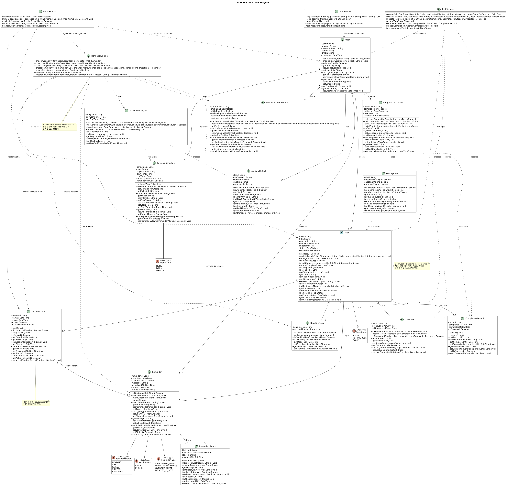
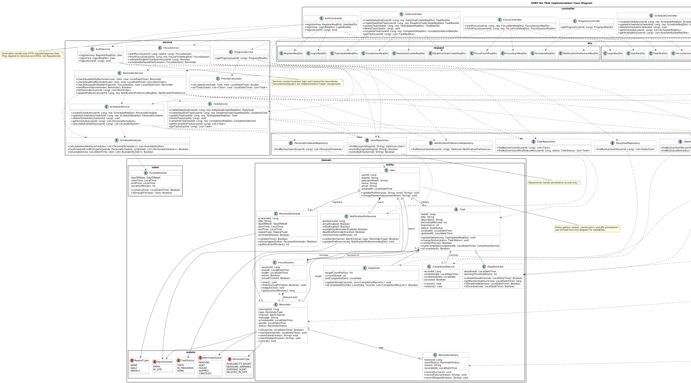

# SURF the TAsk Design

**Student No:** 22212069  
**Name:** 박성준  
**Status:** Design  
**Last Update:** 2026-06-05

---

## Contents

1. [Introduction](#1-introduction)
2. [Class Diagram](#2-class-diagram)
3. [Sequence Diagram](#3-sequence-diagram)
4. [State Machine Diagram](#4-state-machine-diagram)
5. [Implementation Requirement](#5-implementation-requirement)
6. [Glossary](#6-glossary)
7. [References](#7-references)

---

## 1. Introduction

SURF the TAsk는 사용자의 개인 시간표를 분석하여 실제로 수행 가능한 시간에 할 일을 추천하고, Daily Goal과 Deadline Task를 구분해 관리하는 지능형 To-do Planner이다. 사용자는 목표와 업무를 등록하고, Focus On/Off 모드를 통해 집중 상태를 관리하며, 시스템은 가용 시간 기반 알림, 마감 알림, 진행 현황 시각화를 제공한다.

본 문서는 분석 단계에서 정의한 도메인 객체와 주요 흐름을 구현 관점으로 정리한다. Class Diagram은 객체 책임과 계층 구조를, Sequence Diagram은 주요 Use Case 흐름을, State Machine Diagram은 사용자가 마주하는 화면, 폼, 팝업, 알림 배너의 전환을 설명한다.

---

## 2. Class Diagram

### 2.1 Object-Oriented Class Diagram

Class Diagram은 `Task`를 공통 상위 클래스로 두고 `DailyGoal`, `DeadlineTask`가 이를 상속하는 구조로 구성된다. 사용자의 일정(`PersonalSchedule`), 가용 시간(`AvailabilitySlot`), 집중 세션(`FocusSession`), 알림(`Reminder`)은 각각 독립적인 책임을 가진 객체로 분리되며, `ReminderEngine`, `ScheduleAnalyzer`, `PriorityRule`은 알림 판단, 시간 분석, 우선순위 계산을 표현한다.

이 다이어그램은 구현 계층보다 도메인 개념의 관계와 협력을 보여주는 데 초점을 둔다.

### 2.2 Implementation Class Diagram

Implementation Class Diagram은 Controller, Service, Repository 계층을 기준으로 실제 구현 구조를 나타낸다. `Controller`는 요청과 응답을 처리하고 DTO를 사용하며, `Service`는 업무 규칙과 트랜잭션 경계를 담당한다. `Repository`는 데이터 저장소 접근을 전담하고, `domain.entity`, `domain.value`, `domain.enums` 패키지는 핵심 도메인 모델을 보관한다.

각 Use Case가 Controller에서 시작해 Service를 거쳐 Repository와 Entity로 이어지는 흐름을 추적하기 쉽도록 계층 간 의존 방향을 명확히 한다.

### 2.3 Class Attributes and Methods

본 절은 구현 클래스의 주요 속성과 메서드를 요약한다. Spring Data JPA 기본 CRUD 메서드와 Service 내부 private helper 메서드는 주요 책임 설명에서 제외한다.

#### 2.3.1 Controller and Scheduler

| Class | Attributes | Methods | Description |
|---|---|---|---|
| AuthController | 없음 | `register`, `login`, `logout` | 회원가입, 로그인, 로그아웃 요청을 받고 `AuthService`에 처리를 위임한다. |
| TaskController | 없음 | `createDailyGoal`, `createDeadlineTask`, `updateTask`, `deleteTask`, `completeTask`, `getTasks` | Daily Goal과 Deadline Task의 생성, 수정, 삭제, 완료, 목록 조회 API를 제공한다. |
| ScheduleController | 없음 | `createSchedule`, `updateSchedule`, `deleteSchedule`, `getSchedules`, `getAvailability` | 개인 시간표 등록/수정/삭제/조회와 가용 시간 조회 API를 제공한다. |
| FocusController | 없음 | `startFocus`, `finishFocus` | Focus On/Off 요청을 받아 집중 세션 시작과 종료 처리를 위임한다. |
| ProgressController | 없음 | `getProgress` | 완료율, streak, 우선순위 요약 등 진행 현황 조회 API를 제공한다. |
| ReminderController | 없음 | `getReminders`, `updatePreference` | 사용자 알림 목록 조회와 알림 설정 변경 API를 제공한다. |
| ReminderScheduler | 없음 | `runAvailabilityReminderCheck`, `runDeadlineReminderCheck`, `runDelayedInSiteAlertCheck` | 백그라운드에서 가용 시간 알림, 마감 알림, 지연 In-site 알림 조건을 주기적으로 검사한다. |

#### 2.3.2 Service and Helper Components

| Class | Attributes | Methods | Description |
|---|---|---|---|
| AuthService | 없음 | `register`, `login`, `logout` | 사용자 계정 생성, 인증, 로그아웃 처리를 담당한다. |
| TaskService | 없음 | `createDailyGoal`, `createDeadlineTask`, `updateTask`, `deleteTask`, `completeTask`, `getIncompleteTasks`, `getTasks` | 업무/목표의 생명주기를 관리하고 완료 기록을 생성한다. |
| ScheduleService | 없음 | `createSchedule`, `updateSchedule`, `deleteSchedule`, `getSchedules`, `calculateAvailability` | 개인 시간표를 관리하고 가용 시간 계산을 수행한다. |
| FocusService | 없음 | `startFocus`, `finishFocus`, `validateSingleActiveSession`, `scheduleDelayedAlert` | 집중 세션 시작/종료와 사용자별 단일 활성 세션 제약, 지연 알림 예약을 처리한다. |
| ProgressService | 없음 | `getProgress` | 업무 완료율, 미완료 업무 수, Daily Goal streak, 우선순위 요약을 계산해 응답 DTO로 반환한다. |
| ReminderService | 없음 | `checkAvailabilityReminder`, `checkDeadlineReminder`, `checkDelayedInSiteAlert`, `sendReminder`, `listReminders`, `updatePreference` | 알림 조건 판정, 알림 전송, 알림 목록 조회, 알림 설정 변경을 담당한다. |
| PriorityCalculator | 없음 | `calculateScore`, `sortTasks` | 중요도, 마감 임박도, 예상 수행 시간을 기준으로 업무 점수를 계산하고 정렬한다. |
| ScheduleAnalyzer | 없음 | `calculateAvailability`, `hasScheduleConflict`, `isAvailable` | 개인 시간표의 충돌 여부를 확인하고 가용 시간 슬롯을 계산한다. |

#### 2.3.3 Repository

| Class | Attributes | Methods | Description |
|---|---|---|---|
| UserRepository | 없음 | `findByLoginId`, `existsByLoginId`, `existsByEmail` | 로그인 ID와 이메일 중복 여부, 로그인 대상 사용자를 조회한다. |
| NotificationPreferenceRepository | 없음 | `findByUserUserId` | 사용자별 알림 설정을 조회한다. |
| PersonalScheduleRepository | 없음 | `findByUserUserId` | 사용자별 개인 시간표 목록을 조회한다. |
| TaskRepository | 없음 | `findByUserUserId`, `findByUserUserIdAndStatusNot` | 사용자별 업무 목록과 미완료 업무 목록을 조회한다. |
| DailyGoalRepository | 없음 | `findByUserUserId` | 사용자별 Daily Goal 목록을 조회한다. |
| DeadlineTaskRepository | 없음 | `findByUserUserId`, `findByStatusNot` | 사용자별 Deadline Task와 완료되지 않은 마감 업무를 조회한다. |
| CompletionRecordRepository | 없음 | `findByTaskTaskId`, `findByTaskUserUserId` | 특정 업무 또는 사용자 전체의 완료 기록을 조회한다. |
| FocusSessionRepository | 없음 | `findByUserUserIdAndActiveTrue`, `findByActiveTrue` | 사용자별 활성 집중 세션과 전체 활성 집중 세션을 조회한다. |
| ReminderRepository | 없음 | `findByUserUserId`, `findByStatusAndScheduledAtBefore` | 사용자별 알림과 전송 예정 시간이 지난 대기 알림을 조회한다. |
| ReminderHistoryRepository | 없음 | `findByReminderReminderId` | 특정 알림의 전송 이력을 조회한다. |

#### 2.3.4 Domain Entity and Value

| Class | Attributes | Methods | Description |
|---|---|---|---|
| User | `userId`, `loginId`, `passwordHash`, `name`, `email`, `createdAt` | `updateProfile`, `changePassword` | 회원의 인증 정보와 프로필 정보를 보관한다. |
| NotificationPreference | `preferenceId`, `emailEnabled`, `inSiteEnabled`, `availabilityReminderEnabled`, `deadlineReminderEnabled`, `minimumIntervalMinutes` | `canSend`, `updatePreference` | 알림 채널과 알림 유형별 허용 여부를 관리한다. |
| PersonalSchedule | `scheduleId`, `title`, `dayOfWeek`, `startTime`, `endTime`, `repeatType`, `reminderAllowed` | `validateTime`, `isOverlapped`, `getDurationMinutes` | 사용자의 고정 일정과 반복 정보를 저장하고 시간 유효성 및 충돌 여부를 판단한다. |
| Task | `taskId`, `title`, `description`, `estimatedMinutes`, `importance`, `status`, `createdAt`, `updatedAt` | `updateDetails`, `changeStatus`, `canStartFocus`, `markComplete`, `isCompleted` | Daily Goal과 Deadline Task가 공유하는 업무 속성과 상태 전이를 정의하는 추상 클래스이다. |
| DailyGoal | `targetCountPerDay`, `currentStreak`, `lastCompletedDate` | `updateStreak`, `isCompletedOn` | 반복 목표의 일별 완료 여부와 streak 상태를 관리한다. |
| DeadlineTask | `deadlineAt`, `warningThresholdHours` | `validateDeadline`, `getRemainingHours`, `isDeadlineNear`, `isOverdue` | 마감 기한과 마감 임박/초과 여부를 계산한다. |
| CompletionRecord | `recordId`, `completedAt`, `completedDate`, `canceled` | `cancel`, `restore` | 업무 완료 이력과 완료 취소 여부를 기록한다. |
| FocusSession | `sessionId`, `startAt`, `endAt`, `active`, `actualFinished` | `start`, `finish`, `keepActive`, `getDurationMinutes` | 집중 모드의 시작, 종료, 유지 상태를 기록한다. |
| Reminder | `reminderId`, `type`, `channel`, `message`, `scheduledAt`, `sentAt`, `status` | `isDue`, `markSent`, `markFailed`, `markSkipped`, `cancel` | 알림 전송 대상, 채널, 예약 시각, 전송 상태를 관리한다. |
| ReminderHistory | `historyId`, `resultStatus`, `reason`, `recordedAt` | `recordSuccess`, `recordFailure`, `recordSkipped` | 알림 전송 결과와 제외 사유를 기록한다. |
| AvailabilitySlot | `dayOfWeek`, `startTime`, `endTime`, `durationMinutes` | `contains`, `isEnoughFor` | 사용자가 업무를 수행할 수 있는 시간 구간을 표현하는 값 객체이다. |

#### 2.3.5 DTO and Enum

| Class | Attributes | Methods | Description |
|---|---|---|---|
| Request DTOs | 요청별 입력 필드 | 없음 | `RegisterReqDto`, `LoginReqDto`, `DailyGoalCreateReqDto`, `DeadlineTaskCreateReqDto`, `TaskUpdateReqDto`, `CompletionReqDto`, `ScheduleReqDto`, `FocusStartReqDto`, `FocusFinishReqDto`, `NotificationPreferenceReqDto`는 Controller 입력 데이터를 전달한다. |
| Response DTOs | 응답별 출력 필드 | 없음 | `UserResDto`, `LoginResDto`, `TaskResDto`, `CompletionRecordResDto`, `ScheduleResDto`, `AvailabilitySlotResDto`, `FocusSessionResDto`, `ProgressResDto`, `ReminderResDto`, `NotificationPreferenceResDto`는 Service 처리 결과를 화면/API 응답으로 전달한다. |
| TaskStatus | `TODO`, `IN_PROGRESS`, `DONE` | 없음 | 업무의 미시작/진행/완료 상태를 표현한다. |
| ReminderType | `AVAILABILITY_BASED`, `DEADLINE_WARNING`, `OVERDUE_ALERT`, `DELAYED_IN_SITE` | 없음 | 알림의 발생 이유를 구분한다. |
| ReminderStatus | `PENDING`, `SENT`, `FAILED`, `SKIPPED`, `CANCELED` | 없음 | 알림의 전송 상태를 표현한다. |
| AlertChannel | `EMAIL`, `IN_SITE` | 없음 | 알림 전달 채널을 구분한다. |
| RepeatType | `NONE`, `DAILY`, `WEEKLY` | 없음 | 개인 일정 반복 유형을 구분한다. |

---

## 3. Sequence Diagram

Sequence Diagram은 다음 두 문서로 구분한다.

- 객체 흐름: [`Class_Object_Sequence_Diagrams_22212069_박성준.md`](./Class_Object_Sequence_Diagrams_22212069_박성준.md)는 Class Diagram의 객체와 메서드를 기준으로 Use Case별 메시지 흐름을 정리한다.
- 구현 흐름: [`Sequence_Diagrams_22212069_박성준.md`](./Sequence_Diagrams_22212069_박성준.md)는 사용자, UI, Controller, Service, Repository, Database 사이의 호출 순서를 정리한다.

---

## 4. State Machine Diagram

State Machine Diagram은 [`State_Machine_Diagram_22212069_박성준.md`](./State_Machine_Diagram_22212069_박성준.md)에서 확인할 수 있다.

해당 문서는 UI 계층 관점에서 대시보드, 업무 등록 폼, 항목 상세 화면, 집중 모드 화면, 종료 확인 팝업, 알림 배너처럼 사용자가 인지할 수 있는 상태와 이벤트를 기준으로 전이를 설명한다.

Task Management UI, Focus Mode UI, Reminder UI, Deadline Monitoring UI의 4개 하위 상태 머신과 Overall Service UI State Machine으로 전체 화면 흐름을 정리한다.

---

## 5. Implementation Requirement

### 5.1 Technology Stack

| Area | Stack |
|---|---|
| Backend Language | Java |
| Backend Framework | Spring Boot, Spring MVC |
| Persistence | Spring Data JPA |
| Database | H2 또는 MySQL |
| View/API Boundary | REST Controller, DTO 기반 요청/응답 |
| Scheduler | Spring Scheduler |
| Notification | Email Service, Browser In-site Notification |
| Test | JUnit, Spring Boot Test |
| Documentation | Markdown, PlantUML |

### 5.2 Implementation Requirements

1. `Controller`는 HTTP 요청/응답과 DTO 변환만 담당하고, 비즈니스 로직은 `Service`에 위임한다.
2. `Service`는 회원가입/로그인, 업무 관리, 개인 시간표 관리, 집중 모드, 알림, 진행 현황 계산의 주요 Use Case를 구현한다.
3. `Repository`는 Entity 저장, 조회, 삭제만 담당하며 Controller에서 직접 호출하지 않는다.
4. `Task`는 `DailyGoal`과 `DeadlineTask`의 공통 속성 및 상태를 추상화한다.
5. 개인 시간표 등록 시 시작 시간과 종료 시간을 검증하고, 기존 일정과 충돌하는지 확인한다.
6. `ScheduleAnalyzer`는 개인 시간표를 바탕으로 가용 시간 슬롯을 계산한다.
7. `PriorityCalculator`는 중요도, 마감 임박도, 예상 수행 시간을 기준으로 업무 우선순위를 계산한다.
8. Focus Session은 사용자별로 동시에 하나만 활성화될 수 있어야 한다.
9. Focus Off 시 실제 종료 여부를 확인하고, 실제 종료가 아니면 지연 In-site 알림을 예약한다.
10. `ReminderService`는 알림 설정과 최근 알림 이력을 확인하여 중복 알림을 방지한다.
11. Scheduler는 가용 시간 기반 알림, 마감 경고/초과 알림, 지연 In-site 알림을 주기적으로 검사한다.
12. 진행 현황은 완료율, 미완료 업무 수, Daily Goal streak, 우선순위 요약을 포함해야 한다.
13. 주요 화면 전이는 State Machine Diagram의 `Task Management UI`, `Focus Mode UI`, `Reminder UI`, `Deadline Monitoring UI`, `Overall Service UI` 상태 규칙을 따른다.
14. 핵심 Service 로직은 단위 테스트로 검증하고, Controller 요청/응답은 통합 테스트로 검증한다.

---

## 6. Glossary

| Term | Meaning |
|---|---|
| SURF the TAsk | 가용 시간 분석, 업무 관리, 집중 모드, 알림을 결합한 To-do Planner 서비스 |
| User | 서비스를 사용하는 회원 |
| Daily Goal | 매일 반복적으로 수행해야 하는 목표 |
| Deadline Task | 정해진 마감 기한 전까지 완료해야 하는 업무 |
| Task | Daily Goal과 Deadline Task의 공통 상위 개념 |
| Personal Schedule | 사용자가 등록한 수업, 고정 일정, 개인 일정 |
| Availability Slot | 개인 시간표를 분석해 계산한 수행 가능 시간 구간 |
| Focus Session | 사용자가 특정 업무에 집중하는 시작부터 종료까지의 기록 |
| Focus On | 사용자가 업무 집중을 시작한 상태 |
| Focus Off | 사용자가 업무 집중 종료를 요청한 상태 |
| Completion Record | 업무 또는 목표 완료 이력 |
| Streak | Daily Goal을 연속으로 완료한 일수 |
| Priority | 업무의 중요도와 마감 임박도를 반영한 처리 우선순위 |
| Reminder | 사용자에게 전송되는 알림 |
| Reminder History | 알림 전송 성공, 실패, 제외, 취소 이력 |
| Notification Preference | 사용자의 이메일 및 In-site 알림 허용 설정 |
| Scheduler | 정해진 주기 또는 예약 시간에 알림 조건을 검사하는 백그라운드 실행 주체 |
| Controller | 사용자 요청을 받아 Service에 위임하고 응답을 반환하는 계층 |
| Service | 비즈니스 로직과 트랜잭션을 담당하는 계층 |
| Repository | 데이터 저장소 접근을 담당하는 계층 |
| DTO | 계층 간 요청/응답 데이터를 전달하기 위한 객체 |

---

## 7. References

1. FocusFlight - 비행시간 집중법
2. [Duolingo Streak](https://blog.duolingo.com/ko/what-is-duolingo-streak/)
