# SURF the TAsk Implementation Sequence Diagrams

**Source:** `Analysis_22212069_박성준.md`  
**Scope:** UC-01 ~ UC-15  
**Purpose:** 구현 단계에서 화면, Controller, Service, Repository, 외부 서비스 간 흐름을 확인하기 위한 Sequence Diagram  
**Last Update:** 2026-05-31

---

## 작성 방식

- 각 Use Case는 성공 흐름과 예외 흐름을 별도 다이어그램으로 구분한다.
- 화면 입력과 사용자 확인은 `Web UI`, 요청과 응답은 `Controller`가 담당한다.
- 검증, 정책 판단, 상태 변경은 `Service`가 담당한다.
- 저장과 조회는 `Repository`와 `Database`가 담당한다.
- 외부 알림 전송은 `EmailClient`, `BrowserNotificationGateway`로 표현한다.

---

## UC-01 Register

### UC-01 Main - 회원가입 성공

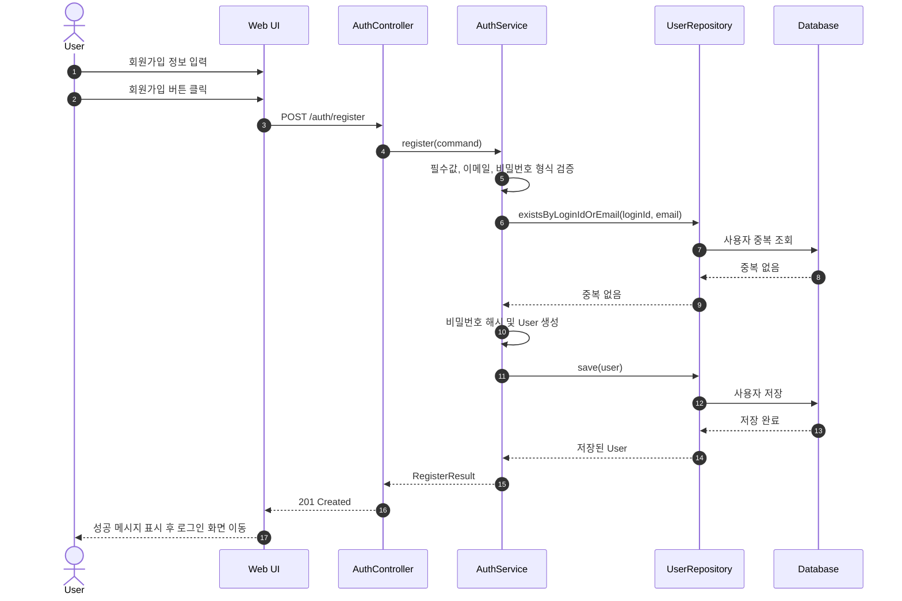

### UC-01-E1 - 필수 정보 누락

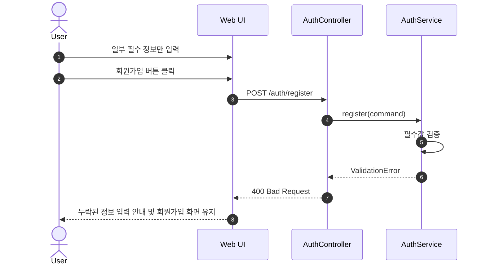

### UC-01-E2 - ID 또는 이메일 중복

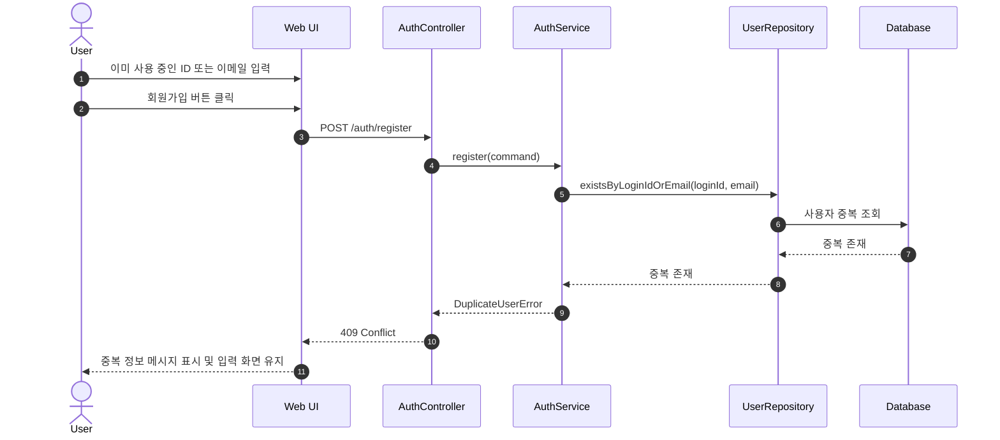

### UC-01-E3 - 비밀번호 형식 오류

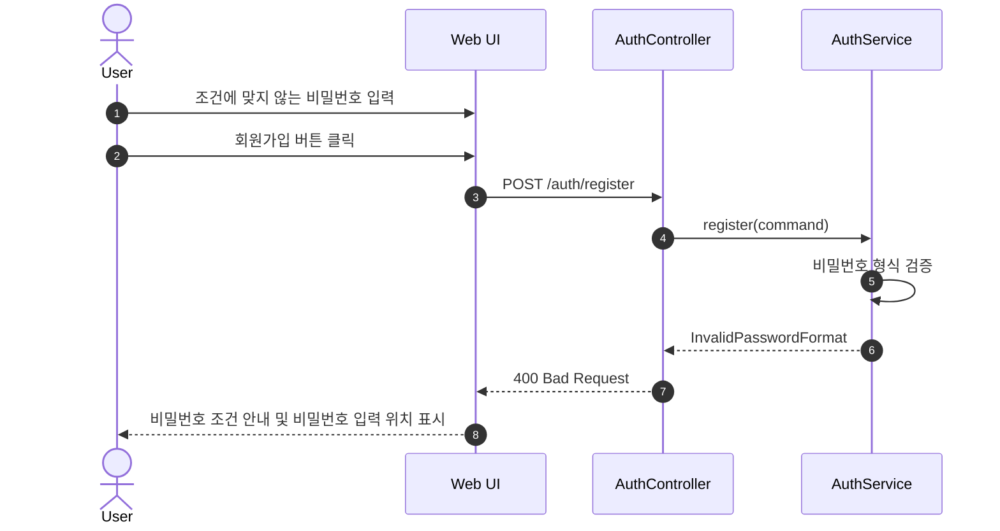

### UC-01-E4 - 저장 오류

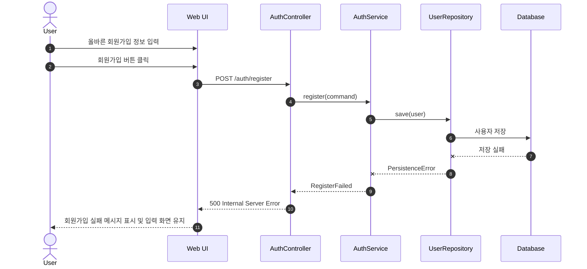

---

## UC-02 Log In

### UC-02 Main - 로그인 성공

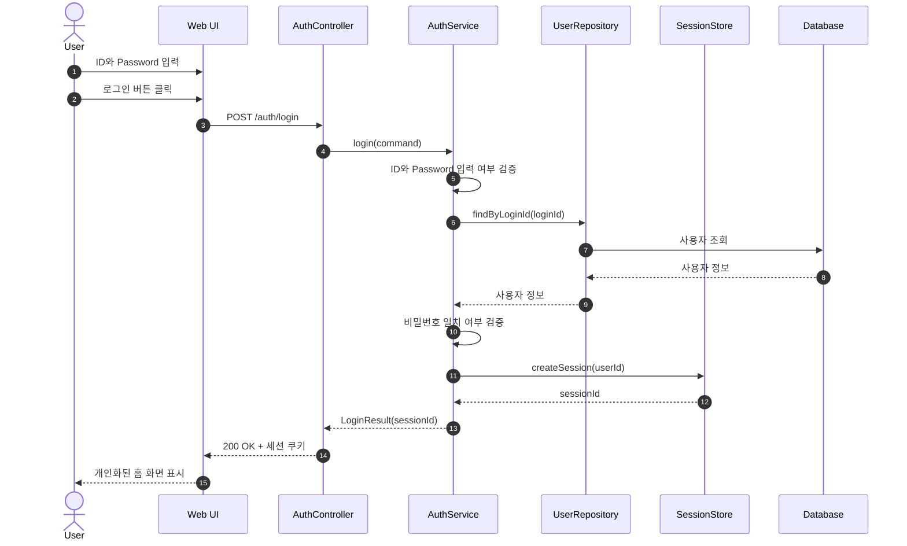

### UC-02-E1 - ID 또는 Password 누락

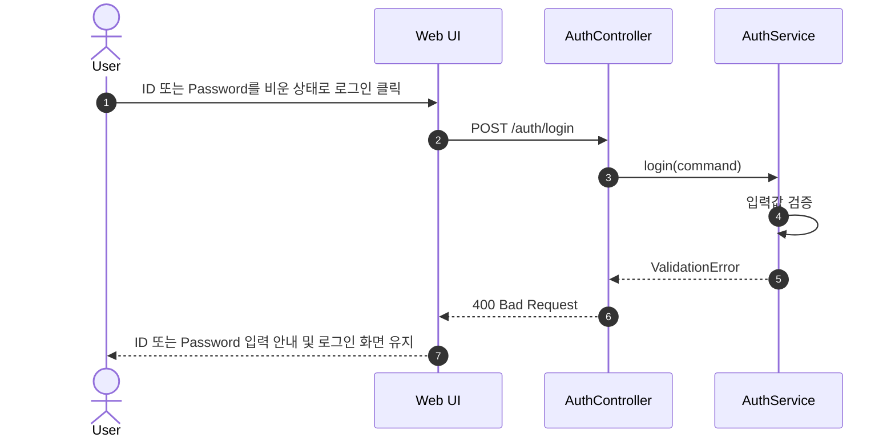

### UC-02-E2 - 등록되지 않은 계정

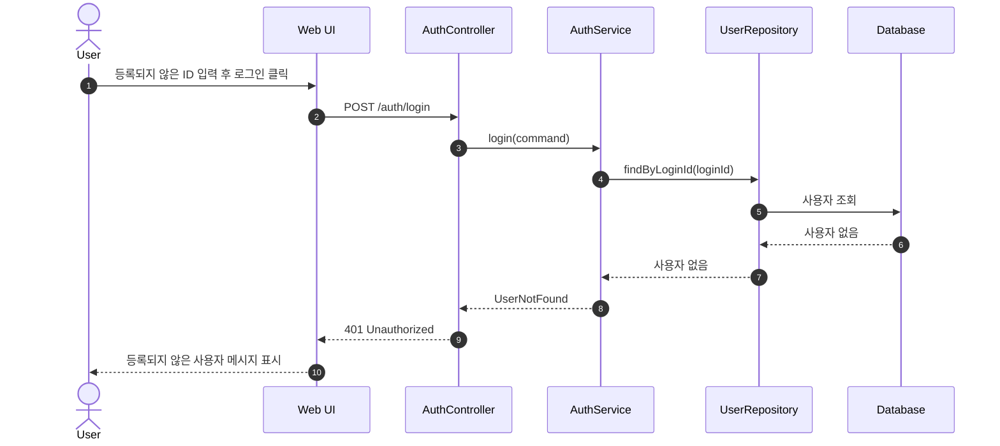

### UC-02-E3 - Password 불일치

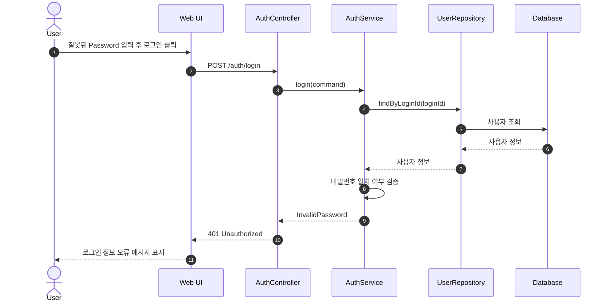

### UC-02-E4 - 세션 생성 실패

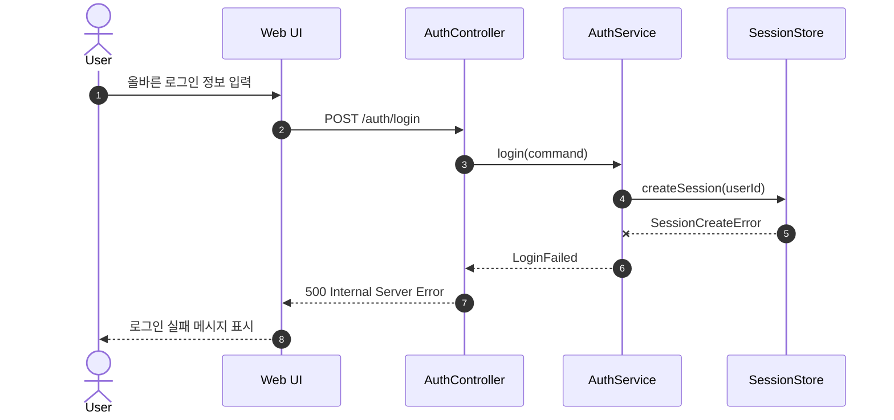

---

## UC-03 Register Personal Schedule

### UC-03 Main - 개인 시간표 등록 성공

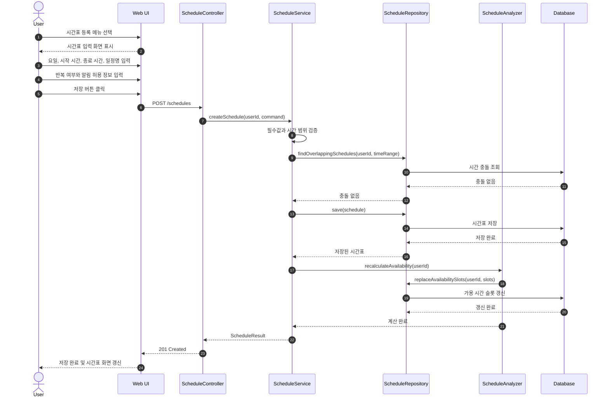

### UC-03-E1 - 시작 시간이 종료 시간보다 늦음

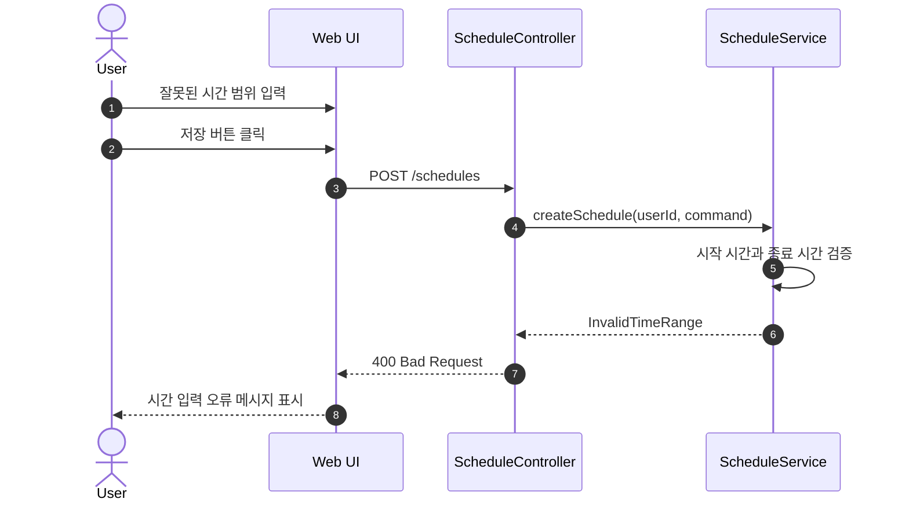

### UC-03-E2 - 필수 입력값 누락

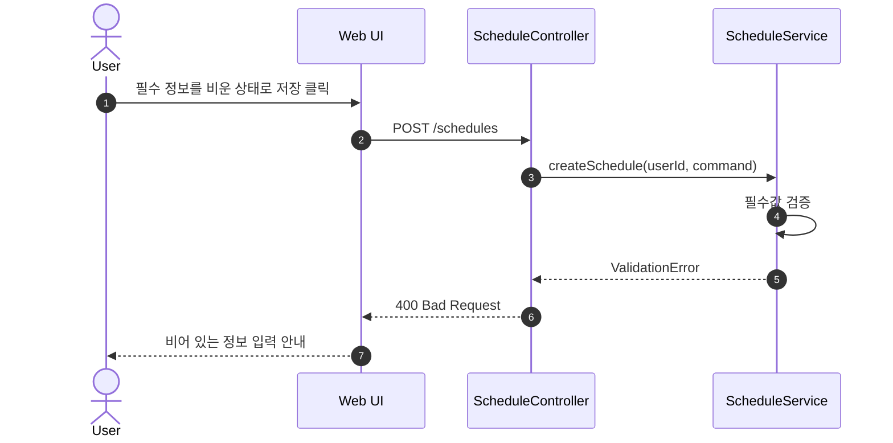

### UC-03-E3 - 기존 일정과 시간 충돌

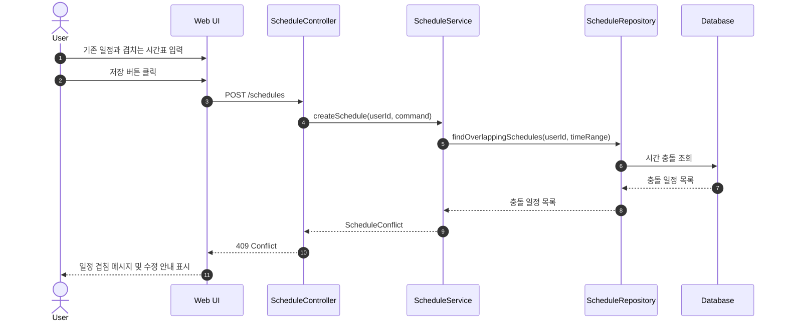

### UC-03-E4 - 시간표 저장 실패

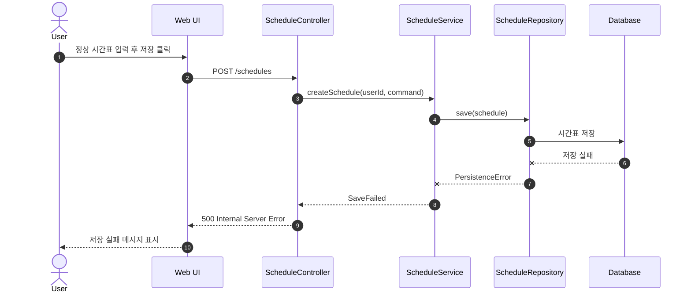

---

## UC-04 Register Daily Goal

### UC-04 Main - Daily Goal 등록 성공

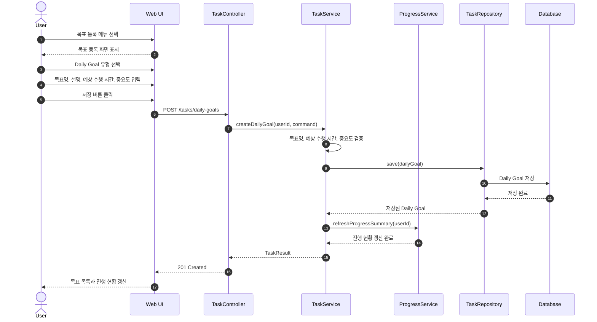

### UC-04-E1 - 목표명 누락

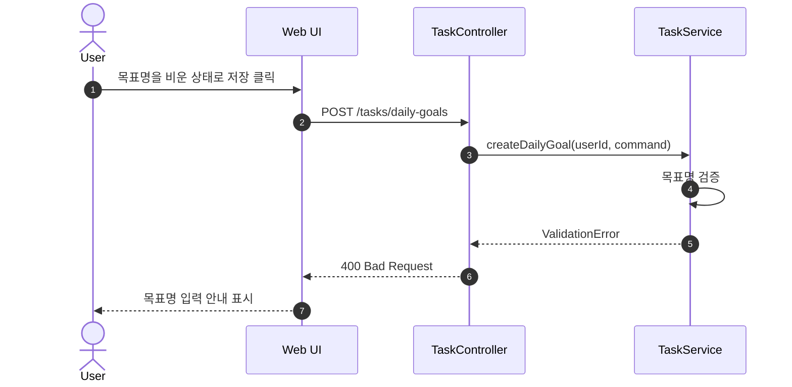

### UC-04-E2 - 예상 수행 시간 형식 오류

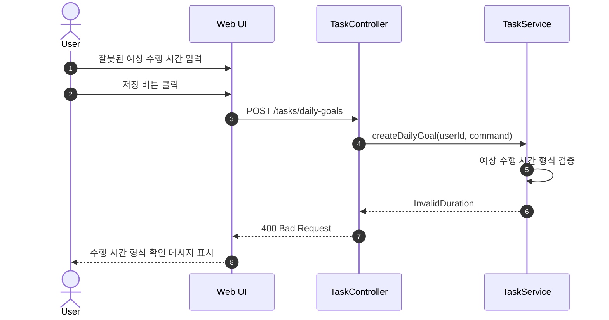

### UC-04-E3 - Daily Goal 저장 실패

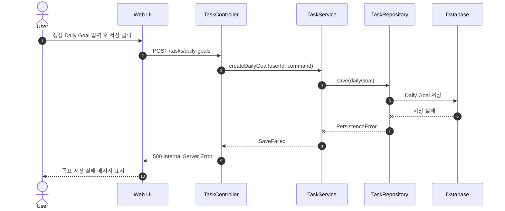

---

## UC-05 Register Deadline Task

### UC-05 Main - Deadline Task 등록 성공

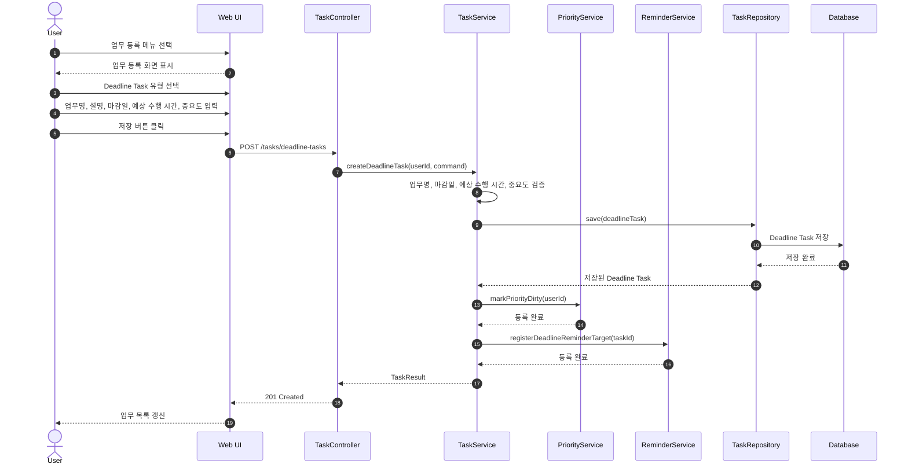

### UC-05-E1 - 업무명 누락

```mermaid
sequenceDiagram
    autonumber
    actor User
    participant UI as Web UI
    participant C as TaskController
    participant S as TaskService

    User->>UI: 업무명을 비운 상태로 저장 클릭
    UI->>C: POST /tasks/deadline-tasks
    C->>S: createDeadlineTask(userId, command)
    S->>S: 업무명 검증
    S-->>C: ValidationError
    C-->>UI: 400 Bad Request
    UI-->>User: 업무명 입력 안내 표시
```

### UC-05-E2 - 마감일이 현재 시점보다 이전

```mermaid
sequenceDiagram
    autonumber
    actor User
    participant UI as Web UI
    participant C as TaskController
    participant S as TaskService

    User->>UI: 과거 마감일 입력
    User->>UI: 저장 버튼 클릭
    UI->>C: POST /tasks/deadline-tasks
    C->>S: createDeadlineTask(userId, command)
    S->>S: 마감일 검증
    S-->>C: InvalidDeadline
    C-->>UI: 400 Bad Request
    UI-->>User: 마감일 재입력 안내 표시
```

### UC-05-E3 - 중요도 미선택

```mermaid
sequenceDiagram
    autonumber
    actor User
    participant UI as Web UI
    participant C as TaskController
    participant S as TaskService
    participant R as TaskRepository
    participant DB as Database

    User->>UI: 중요도를 선택하지 않고 저장 클릭
    UI->>C: POST /tasks/deadline-tasks
    C->>S: createDeadlineTask(userId, command)
    S->>S: 기본 중요도 적용
    S->>R: save(deadlineTask)
    R->>DB: 기본 중요도가 적용된 업무 저장
    DB-->>R: 저장 완료
    R-->>S: 저장된 Deadline Task
    S-->>C: TaskResult
    C-->>UI: 201 Created
    UI-->>User: 기본 중요도 적용 안내 및 업무 목록 갱신
```

### UC-05-E4 - Deadline Task 저장 실패

```mermaid
sequenceDiagram
    autonumber
    actor User
    participant UI as Web UI
    participant C as TaskController
    participant S as TaskService
    participant R as TaskRepository
    participant DB as Database

    User->>UI: 정상 Deadline Task 입력 후 저장 클릭
    UI->>C: POST /tasks/deadline-tasks
    C->>S: createDeadlineTask(userId, command)
    S->>R: save(deadlineTask)
    R->>DB: Deadline Task 저장
    DB--xR: 저장 실패
    R--xS: PersistenceError
    S-->>C: SaveFailed
    C-->>UI: 500 Internal Server Error
    UI-->>User: 업무 저장 실패 메시지 표시
```

---

## UC-06 Check Task Completion

### UC-06 Main - 완료 체크 성공

```mermaid
sequenceDiagram
    autonumber
    actor User
    participant UI as Web UI
    participant C as TaskController
    participant S as TaskService
    participant P as ProgressService
    participant R as TaskRepository
    participant DB as Database

    User->>UI: 목표 또는 업무 목록 확인
    User->>UI: 완료 체크 클릭
    UI->>C: PATCH /tasks/{taskId}/completion
    C->>S: completeTask(userId, taskId)
    S->>R: findByIdAndUserId(taskId, userId)
    R->>DB: 항목 조회
    DB-->>R: 항목 정보
    R-->>S: 항목 정보
    S->>R: markCompleted(taskId, completedAt)
    R->>DB: 완료 상태와 완료 시각 저장
    DB-->>R: 저장 완료
    R-->>S: 저장 결과
    S->>P: recalculateStreakAndRate(userId)
    P-->>S: 진행 현황 갱신 결과
    S-->>C: CompletionResult
    C-->>UI: 200 OK
    UI-->>User: 완료 상태와 갱신된 진행 현황 표시
```

### UC-06-E1 - 이미 완료된 항목 재체크

```mermaid
sequenceDiagram
    autonumber
    actor User
    participant UI as Web UI
    participant C as TaskController
    participant S as TaskService
    participant R as TaskRepository
    participant DB as Database

    User->>UI: 이미 완료된 항목 체크 클릭
    UI->>C: PATCH /tasks/{taskId}/completion
    C->>S: completeTask(userId, taskId)
    S->>R: findByIdAndUserId(taskId, userId)
    R->>DB: 항목 조회
    DB-->>R: 완료 상태 항목
    R-->>S: 완료 상태 항목
    S-->>C: AlreadyCompleted
    C-->>UI: 409 Conflict
    UI-->>User: 완료 유지 또는 완료 취소 선택 표시
```

### UC-06-E2 - 완료 취소 선택

```mermaid
sequenceDiagram
    autonumber
    actor User
    participant UI as Web UI
    participant C as TaskController
    participant S as TaskService
    participant P as ProgressService
    participant R as TaskRepository
    participant DB as Database

    User->>UI: 완료 취소 클릭
    UI->>C: PATCH /tasks/{taskId}/completion/cancel
    C->>S: cancelCompletion(userId, taskId)
    S->>R: updateStatus(taskId, TODO)
    R->>DB: 미완료 상태 저장
    DB-->>R: 저장 완료
    R-->>S: 저장 결과
    S->>P: refreshProgress(userId)
    P-->>S: 진행 현황 갱신 완료
    S-->>C: CompletionResult
    C-->>UI: 200 OK
    UI-->>User: 미완료 상태 표시
```

### UC-06-E3 - 상태 변경 실패

```mermaid
sequenceDiagram
    autonumber
    actor User
    participant UI as Web UI
    participant C as TaskController
    participant S as TaskService
    participant R as TaskRepository
    participant DB as Database

    User->>UI: 완료 체크 클릭
    UI->>C: PATCH /tasks/{taskId}/completion
    C->>S: completeTask(userId, taskId)
    S->>R: markCompleted(taskId, completedAt)
    R->>DB: 완료 상태 저장
    DB--xR: 저장 실패
    R--xS: PersistenceError
    S-->>C: CompletionFailed
    C-->>UI: 500 Internal Server Error
    UI-->>User: 완료 체크 실패 메시지 표시 및 기존 상태 유지
```

### UC-06-E4 - Streak 계산 실패

```mermaid
sequenceDiagram
    autonumber
    actor User
    participant UI as Web UI
    participant C as TaskController
    participant S as TaskService
    participant P as ProgressService
    participant R as TaskRepository
    participant DB as Database

    User->>UI: 완료 체크 클릭
    UI->>C: PATCH /tasks/{taskId}/completion
    C->>S: completeTask(userId, taskId)
    S->>R: markCompleted(taskId, completedAt)
    R->>DB: 완료 상태 저장
    DB-->>R: 저장 완료
    R-->>S: 저장 결과
    S->>P: recalculateStreakAndRate(userId)
    P--xS: ProgressCalculationError
    S-->>C: CompletionSavedWithProgressWarning
    C-->>UI: 200 OK + 일부 갱신 실패 메시지
    UI-->>User: 완료 상태와 진행 현황 갱신 실패 안내
```

---

## UC-07 Edit Item

### UC-07 Main - 항목 수정 성공

```mermaid
sequenceDiagram
    autonumber
    actor User
    participant UI as Web UI
    participant C as TaskController
    participant S as TaskService
    participant P as PriorityService
    participant N as ReminderService
    participant R as TaskRepository
    participant DB as Database

    User->>UI: 목표 또는 업무 상세 화면에서 수정 클릭
    UI->>C: GET /tasks/{taskId}
    C->>S: getTask(userId, taskId)
    S->>R: findByIdAndUserId(taskId, userId)
    R->>DB: 항목 상세 조회
    DB-->>R: 항목 상세
    R-->>S: 항목 상세
    S-->>C: TaskDetail
    C-->>UI: 200 OK
    UI-->>User: 수정 입력 화면 표시
    User->>UI: 수정 정보 입력 후 저장 클릭
    UI->>C: PUT /tasks/{taskId}
    C->>S: updateTask(userId, taskId, command)
    S->>S: 필수값과 마감일 형식 검증
    S->>R: update(task)
    R->>DB: 수정 정보 저장
    DB-->>R: 저장 완료
    R-->>S: 수정된 항목
    S->>P: markPriorityDirty(userId)
    P-->>S: 갱신 완료
    S->>N: refreshReminderCondition(taskId)
    N-->>S: 갱신 완료
    S-->>C: TaskResult
    C-->>UI: 200 OK
    UI-->>User: 수정된 목록과 상세 정보 표시
```

### UC-07-E1 - 필수 입력값 누락

```mermaid
sequenceDiagram
    autonumber
    actor User
    participant UI as Web UI
    participant C as TaskController
    participant S as TaskService

    User->>UI: 필수값을 비운 상태로 수정 저장 클릭
    UI->>C: PUT /tasks/{taskId}
    C->>S: updateTask(userId, taskId, command)
    S->>S: 필수값 검증
    S-->>C: ValidationError
    C-->>UI: 400 Bad Request
    UI-->>User: 비어 있는 정보 입력 안내 및 수정 화면 유지
```

### UC-07-E2 - Deadline Task 마감일 형식 오류

```mermaid
sequenceDiagram
    autonumber
    actor User
    participant UI as Web UI
    participant C as TaskController
    participant S as TaskService

    User->>UI: 잘못된 마감일 형식 입력 후 저장 클릭
    UI->>C: PUT /tasks/{taskId}
    C->>S: updateTask(userId, taskId, command)
    S->>S: 마감일 형식 검증
    S-->>C: InvalidDeadline
    C-->>UI: 400 Bad Request
    UI-->>User: 마감일 형식 오류 메시지 표시
```

### UC-07-E3 - 수정 저장 실패

```mermaid
sequenceDiagram
    autonumber
    actor User
    participant UI as Web UI
    participant C as TaskController
    participant S as TaskService
    participant R as TaskRepository
    participant DB as Database

    User->>UI: 정상 수정 정보 입력 후 저장 클릭
    UI->>C: PUT /tasks/{taskId}
    C->>S: updateTask(userId, taskId, command)
    S->>R: update(task)
    R->>DB: 수정 정보 저장
    DB--xR: 저장 실패
    R--xS: PersistenceError
    S-->>C: UpdateFailed
    C-->>UI: 500 Internal Server Error
    UI-->>User: 기존 정보 유지 및 수정 실패 메시지 표시
```

---

## UC-08 Delete Item

### UC-08 Main - 항목 삭제 성공

```mermaid
sequenceDiagram
    autonumber
    actor User
    participant UI as Web UI
    participant C as TaskController
    participant S as TaskService
    participant P as ProgressService
    participant R as TaskRepository
    participant DB as Database

    User->>UI: 목표 또는 업무 상세 화면에서 삭제 클릭
    UI-->>User: 삭제 확인 팝업 표시
    User->>UI: 삭제 확인 클릭
    UI->>C: DELETE /tasks/{taskId}
    C->>S: deleteTask(userId, taskId)
    S->>R: deleteByIdAndUserId(taskId, userId)
    R->>DB: 항목 삭제
    DB-->>R: 삭제 완료
    R-->>S: 삭제 결과
    S->>P: refreshProgress(userId)
    P-->>S: 갱신 완료
    S-->>C: DeleteResult
    C-->>UI: 204 No Content
    UI-->>User: 목록과 진행 현황 갱신
```

### UC-08-E1 - 삭제 취소

```mermaid
sequenceDiagram
    autonumber
    actor User
    participant UI as Web UI

    User->>UI: 목표 또는 업무 상세 화면에서 삭제 클릭
    UI-->>User: 삭제 확인 팝업 표시
    User->>UI: 취소 클릭
    UI-->>User: 항목 상세 화면 유지
```

### UC-08-E2 - 삭제 실패

```mermaid
sequenceDiagram
    autonumber
    actor User
    participant UI as Web UI
    participant C as TaskController
    participant S as TaskService
    participant R as TaskRepository
    participant DB as Database

    User->>UI: 삭제 확인 클릭
    UI->>C: DELETE /tasks/{taskId}
    C->>S: deleteTask(userId, taskId)
    S->>R: deleteByIdAndUserId(taskId, userId)
    R->>DB: 항목 삭제
    DB--xR: 삭제 실패
    R--xS: PersistenceError
    S-->>C: DeleteFailed
    C-->>UI: 500 Internal Server Error
    UI-->>User: 기존 항목 유지 및 삭제 실패 메시지 표시
```

### UC-08-E3 - 진행 현황 갱신 실패

```mermaid
sequenceDiagram
    autonumber
    actor User
    participant UI as Web UI
    participant C as TaskController
    participant S as TaskService
    participant P as ProgressService
    participant R as TaskRepository
    participant DB as Database

    User->>UI: 삭제 확인 클릭
    UI->>C: DELETE /tasks/{taskId}
    C->>S: deleteTask(userId, taskId)
    S->>R: deleteByIdAndUserId(taskId, userId)
    R->>DB: 항목 삭제
    DB-->>R: 삭제 완료
    R-->>S: 삭제 결과
    S->>P: refreshProgress(userId)
    P--xS: ProgressRefreshError
    S-->>C: DeleteSucceededWithWarning
    C-->>UI: 200 OK + 화면 갱신 경고
    UI-->>User: 삭제 완료 및 일부 갱신 실패 안내
```

---

## UC-09 Turn On Focus Mode

### UC-09 Main - 집중 모드 시작 성공

```mermaid
sequenceDiagram
    autonumber
    actor User
    participant UI as Web UI
    participant C as FocusController
    participant S as FocusService
    participant TR as TaskRepository
    participant FR as FocusSessionRepository
    participant DB as Database

    User->>UI: 목표 또는 업무에서 Focus On 클릭
    UI->>C: POST /focus-sessions
    C->>S: startFocus(userId, taskId)
    S->>FR: findActiveSession(userId)
    FR->>DB: 활성 Focus Session 조회
    DB-->>FR: 활성 세션 없음
    FR-->>S: 활성 세션 없음
    S->>TR: findByIdAndUserId(taskId, userId)
    TR->>DB: 항목 상태 조회
    DB-->>TR: 진행 가능 상태
    TR-->>S: 진행 가능 상태
    S->>TR: updateStatus(taskId, IN_PROGRESS)
    TR->>DB: 진행 중 상태 저장
    DB-->>TR: 저장 완료
    S->>FR: save(FocusSession)
    FR->>DB: 시작 시각 기록
    DB-->>FR: 저장 완료
    FR-->>S: FocusSession
    S-->>C: FocusSessionResult
    C-->>UI: 201 Created
    UI-->>User: 집중 모드 화면 표시
```

### UC-09-E1 - 이미 다른 항목이 Focus On 상태

```mermaid
sequenceDiagram
    autonumber
    actor User
    participant UI as Web UI
    participant C as FocusController
    participant S as FocusService
    participant FR as FocusSessionRepository
    participant DB as Database

    User->>UI: Focus On 클릭
    UI->>C: POST /focus-sessions
    C->>S: startFocus(userId, taskId)
    S->>FR: findActiveSession(userId)
    FR->>DB: 활성 Focus Session 조회
    DB-->>FR: 활성 세션 존재
    FR-->>S: 활성 세션 존재
    S-->>C: ActiveFocusSessionExists
    C-->>UI: 409 Conflict
    UI-->>User: 기존 작업 종료 또는 현재 요청 취소 안내
```

### UC-09-E2 - 선택 항목이 이미 완료됨

```mermaid
sequenceDiagram
    autonumber
    actor User
    participant UI as Web UI
    participant C as FocusController
    participant S as FocusService
    participant TR as TaskRepository
    participant DB as Database

    User->>UI: 완료된 항목에서 Focus On 클릭
    UI->>C: POST /focus-sessions
    C->>S: startFocus(userId, taskId)
    S->>TR: findByIdAndUserId(taskId, userId)
    TR->>DB: 항목 상태 조회
    DB-->>TR: 완료 상태
    TR-->>S: 완료 상태
    S-->>C: CompletedTaskCannotFocus
    C-->>UI: 400 Bad Request
    UI-->>User: 완료 항목은 집중 모드 불가 메시지 표시
```

### UC-09-E3 - 집중 모드 시작 저장 실패

```mermaid
sequenceDiagram
    autonumber
    actor User
    participant UI as Web UI
    participant C as FocusController
    participant S as FocusService
    participant TR as TaskRepository
    participant DB as Database

    User->>UI: Focus On 클릭
    UI->>C: POST /focus-sessions
    C->>S: startFocus(userId, taskId)
    S->>TR: updateStatus(taskId, IN_PROGRESS)
    TR->>DB: 진행 중 상태 저장
    DB--xTR: 저장 실패
    TR--xS: PersistenceError
    S-->>C: FocusStartFailed
    C-->>UI: 500 Internal Server Error
    UI-->>User: 집중 모드 시작 실패 메시지 표시
```

---

## UC-10 Turn Off Focus Mode

### UC-10 Main - 집중 모드 정상 종료

```mermaid
sequenceDiagram
    autonumber
    actor User
    participant UI as Web UI
    participant C as FocusController
    participant S as FocusService
    participant TR as TaskRepository
    participant FR as FocusSessionRepository
    participant DB as Database

    User->>UI: Focus Off 클릭
    UI-->>User: 실제 업무 종료 여부 확인 팝업 표시
    User->>UI: 실제 종료 클릭
    UI->>C: POST /focus-sessions/{sessionId}/close
    C->>S: closeFocus(userId, sessionId, completeTask)
    S->>FR: closeSession(sessionId, endedAt)
    FR->>DB: 종료 시각 저장
    DB-->>FR: 저장 완료
    FR-->>S: 종료된 Focus Session
    S->>TR: updateStatus(taskId, TODO 또는 DONE)
    TR->>DB: 항목 상태 갱신
    DB-->>TR: 갱신 완료
    TR-->>S: 갱신 결과
    S-->>C: FocusCloseResult
    C-->>UI: 200 OK
    UI-->>User: 홈 화면 또는 목표 목록 표시
```

### UC-10-E1 - 실제 종료가 아니라고 선택

```mermaid
sequenceDiagram
    autonumber
    actor User
    participant UI as Web UI
    participant C as FocusController
    participant S as FocusService
    participant FR as FocusSessionRepository
    participant AR as AlertReservationRepository
    participant DB as Database

    User->>UI: Focus Off 클릭
    UI-->>User: 실제 업무 종료 여부 확인 팝업 표시
    User->>UI: 실제 종료 아님 클릭
    UI->>C: POST /focus-sessions/{sessionId}/delay-alert
    C->>S: keepFocusAndReserveAlert(userId, sessionId)
    S->>FR: verifyActiveSession(userId, sessionId)
    FR->>DB: 활성 세션 확인
    DB-->>FR: 활성 세션
    FR-->>S: 활성 세션
    S->>AR: saveDelayAlert(sessionId, now + 5 minutes)
    AR->>DB: 지연 알림 예약 저장
    DB-->>AR: 저장 완료
    AR-->>S: 예약 결과
    S-->>C: DelayAlertReserved
    C-->>UI: 202 Accepted
    UI-->>User: 집중 상태 유지 및 5분 후 알림 안내
```

### UC-10-E2 - 종료 시간 기록 실패

```mermaid
sequenceDiagram
    autonumber
    actor User
    participant UI as Web UI
    participant C as FocusController
    participant S as FocusService
    participant FR as FocusSessionRepository
    participant DB as Database

    User->>UI: 실제 종료 클릭
    UI->>C: POST /focus-sessions/{sessionId}/close
    C->>S: closeFocus(userId, sessionId, completeTask)
    S->>FR: closeSession(sessionId, endedAt)
    FR->>DB: 종료 시각 저장
    DB--xFR: 저장 실패
    FR--xS: PersistenceError
    S-->>C: FocusCloseFailed
    C-->>UI: 500 Internal Server Error
    UI-->>User: 집중 모드 종료 실패 메시지 및 Focus On 상태 유지
```

### UC-10-E3 - 완료 처리 저장 실패

```mermaid
sequenceDiagram
    autonumber
    actor User
    participant UI as Web UI
    participant C as FocusController
    participant S as FocusService
    participant TR as TaskRepository
    participant FR as FocusSessionRepository
    participant DB as Database

    User->>UI: 실제 종료 및 완료 처리 선택
    UI->>C: POST /focus-sessions/{sessionId}/close
    C->>S: closeFocus(userId, sessionId, completeTask=true)
    S->>FR: closeSession(sessionId, endedAt)
    FR->>DB: 종료 시각 저장
    DB-->>FR: 저장 완료
    FR-->>S: 종료된 Focus Session
    S->>TR: markCompleted(taskId, completedAt)
    TR->>DB: 완료 상태 저장
    DB--xTR: 저장 실패
    TR--xS: CompletionSaveError
    S-->>C: FocusClosedWithCompletionWarning
    C-->>UI: 200 OK + 완료 저장 실패 메시지
    UI-->>User: 집중 종료 및 완료 저장 실패 안내
```

---

## UC-11 Prioritize Tasks

### UC-11 Main - 우선순위 목록 표시 성공

```mermaid
sequenceDiagram
    autonumber
    actor User
    participant UI as Web UI
    participant C as TaskController
    participant S as TaskQueryService
    participant P as PriorityService
    participant R as TaskRepository
    participant DB as Database

    User->>UI: 우선순위 또는 대시보드 화면 진입
    UI->>C: GET /tasks/priorities
    C->>S: getPrioritizedTasks(userId)
    S->>R: findIncompleteTasks(userId)
    R->>DB: 미완료 Daily Goal과 Deadline Task 조회
    DB-->>R: 미완료 항목 목록
    R-->>S: 미완료 항목 목록
    S->>P: sortByDeadlineImportanceAndDuration(tasks)
    P-->>S: 정렬된 업무 목록
    S-->>C: PriorityList
    C-->>UI: 200 OK
    UI-->>User: 먼저 수행해야 할 업무 목록 표시
```

### UC-11-E1 - 미완료 목표 또는 업무 없음

```mermaid
sequenceDiagram
    autonumber
    actor User
    participant UI as Web UI
    participant C as TaskController
    participant S as TaskQueryService
    participant R as TaskRepository
    participant DB as Database

    User->>UI: 우선순위 화면 진입
    UI->>C: GET /tasks/priorities
    C->>S: getPrioritizedTasks(userId)
    S->>R: findIncompleteTasks(userId)
    R->>DB: 미완료 항목 조회
    DB-->>R: 빈 목록
    R-->>S: 빈 목록
    S-->>C: EmptyTaskList
    C-->>UI: 200 OK + 빈 목록 상태
    UI-->>User: 처리할 목표 없음 메시지와 목표 등록 버튼 표시
```

### UC-11-E2 - Daily Goal만 존재

```mermaid
sequenceDiagram
    autonumber
    actor User
    participant UI as Web UI
    participant C as TaskController
    participant S as TaskQueryService
    participant P as PriorityService
    participant R as TaskRepository
    participant DB as Database

    User->>UI: 우선순위 화면 진입
    UI->>C: GET /tasks/priorities
    C->>S: getPrioritizedTasks(userId)
    S->>R: findIncompleteTasks(userId)
    R->>DB: 미완료 항목 조회
    DB-->>R: 마감일 없는 Daily Goal 목록
    R-->>S: Daily Goal 목록
    S->>P: sortByImportanceAndIncompleteStatus(tasks)
    P-->>S: 정렬된 Daily Goal 목록
    S-->>C: PriorityList
    C-->>UI: 200 OK
    UI-->>User: 중요도 기준 목표 목록 표시
```

### UC-11-E3 - 우선순위 계산 실패

```mermaid
sequenceDiagram
    autonumber
    actor User
    participant UI as Web UI
    participant C as TaskController
    participant S as TaskQueryService
    participant P as PriorityService
    participant R as TaskRepository
    participant DB as Database

    User->>UI: 우선순위 화면 진입
    UI->>C: GET /tasks/priorities
    C->>S: getPrioritizedTasks(userId)
    S->>R: findIncompleteTasks(userId)
    R->>DB: 미완료 항목 조회
    DB-->>R: 미완료 항목 목록
    R-->>S: 미완료 항목 목록
    S->>P: sortByDeadlineImportanceAndDuration(tasks)
    P--xS: PriorityCalculationError
    S-->>C: DefaultSortedListWithWarning
    C-->>UI: 200 OK + 계산 실패 메시지
    UI-->>User: 기본 정렬 또는 기존 정렬 상태 표시
```

---

## UC-12 Review Progress

### UC-12 Main - 진행 현황 표시 성공

```mermaid
sequenceDiagram
    autonumber
    actor User
    participant UI as Web UI
    participant C as ProgressController
    participant S as ProgressService
    participant P as PriorityService
    participant R as TaskRepository
    participant CR as CompletionRecordRepository
    participant DB as Database

    User->>UI: 진행 현황 또는 돌아보기 화면 진입
    UI->>C: GET /progress
    C->>S: getProgressDashboard(userId)
    S->>R: findTasksByUserId(userId)
    R->>DB: 목표와 업무 조회
    DB-->>R: 목표와 업무 목록
    R-->>S: 목표와 업무 목록
    S->>CR: findCompletionRecords(userId)
    CR->>DB: 완료 기록 조회
    DB-->>CR: 완료 기록 목록
    CR-->>S: 완료 기록 목록
    S->>S: Daily Goal streak 계산
    S->>S: 전체 달성률과 미완료 업무 수 계산
    S->>P: getPrioritySummary(userId)
    P-->>S: 우선순위 현황
    S-->>C: ProgressDashboard
    C-->>UI: 200 OK
    UI-->>User: 발자국, 그래프, 목록 형태로 진행 현황 표시
```

### UC-12-E1 - 완료 기록 없음

```mermaid
sequenceDiagram
    autonumber
    actor User
    participant UI as Web UI
    participant C as ProgressController
    participant S as ProgressService
    participant CR as CompletionRecordRepository
    participant DB as Database

    User->>UI: 진행 현황 화면 진입
    UI->>C: GET /progress
    C->>S: getProgressDashboard(userId)
    S->>CR: findCompletionRecords(userId)
    CR->>DB: 완료 기록 조회
    DB-->>CR: 빈 기록 목록
    CR-->>S: 빈 기록 목록
    S-->>C: ProgressDashboard(emptyRecords)
    C-->>UI: 200 OK
    UI-->>User: 완료 기록 없음 및 목표 수행 유도 화면 표시
```

### UC-12-E2 - Streak 계산 실패

```mermaid
sequenceDiagram
    autonumber
    actor User
    participant UI as Web UI
    participant C as ProgressController
    participant S as ProgressService
    participant P as PriorityService

    User->>UI: 진행 현황 화면 진입
    UI->>C: GET /progress
    C->>S: getProgressDashboard(userId)
    S->>S: Daily Goal streak 계산
    S--xS: StreakCalculationError
    S->>S: streak 영역 제외 후 달성률과 미완료 수 계산
    S->>P: getPrioritySummary(userId)
    P-->>S: 우선순위 현황
    S-->>C: ProgressDashboardWithWarning
    C-->>UI: 200 OK + 일부 갱신 실패 메시지
    UI-->>User: streak 제외 진행 현황 표시
```

### UC-12-E3 - 시각화 화면 로딩 실패

```mermaid
sequenceDiagram
    autonumber
    actor User
    participant UI as Web UI
    participant C as ProgressController
    participant S as ProgressService

    User->>UI: 진행 현황 화면 진입
    UI->>C: GET /progress
    C->>S: getProgressDashboard(userId)
    S-->>C: ProgressDashboard
    C-->>UI: 200 OK
    UI--xUser: 시각화 렌더링 실패
    UI-->>User: 진행 현황 표시 실패 메시지와 홈 이동 버튼 표시
```

---

## UC-13 Send Availability-based Reminder

### UC-13 Main - 가용 시간 기반 이메일 알림 전송 성공

```mermaid
sequenceDiagram
    autonumber
    actor Scheduler
    participant J as AvailabilityReminderJob
    participant A as ScheduleAnalyzer
    participant S as ReminderService
    participant E as EmailClient
    participant R as ReminderHistoryRepository
    participant DB as Database
    actor User

    Scheduler->>J: 정해진 주기에 가용 시간 알림 검사 실행
    J->>A: isAvailableNow(userId, now)
    A->>DB: 사용자 시간표와 가용 시간 조회
    DB-->>A: 시간표와 가용 시간
    A-->>J: 가용 시간
    J->>S: buildAvailabilityReminder(userId, now)
    S->>DB: 미완료 목표/업무, 알림 설정, 최근 이력 조회
    DB-->>S: 알림 전송 가능 데이터
    S-->>J: 이메일 제목과 본문
    J->>E: sendEmail(user.email, message)
    E-->>User: 가용 시간 기반 이메일 알림 전송
    E-->>J: 전송 성공
    J->>R: saveSent(reminder)
    R->>DB: 알림 전송 기록 저장
    DB-->>R: 저장 완료
```

### UC-13-E1 - 현재 시간이 가용 시간이 아님

```mermaid
sequenceDiagram
    autonumber
    actor Scheduler
    participant J as AvailabilityReminderJob
    participant A as ScheduleAnalyzer
    participant DB as Database

    Scheduler->>J: 가용 시간 알림 검사 실행
    J->>A: isAvailableNow(userId, now)
    A->>DB: 사용자 시간표와 가용 시간 조회
    DB-->>A: 시간표와 가용 시간
    A-->>J: 가용 시간 아님
    J-->>Scheduler: 알림 미전송 및 다음 검사 대기
```

### UC-13-E2 - 미완료 목표 또는 업무 없음

```mermaid
sequenceDiagram
    autonumber
    actor Scheduler
    participant J as AvailabilityReminderJob
    participant S as ReminderService
    participant R as ReminderHistoryRepository
    participant DB as Database

    Scheduler->>J: 가용 시간 알림 검사 실행
    J->>S: buildAvailabilityReminder(userId, now)
    S->>DB: 미완료 목표와 업무 조회
    DB-->>S: 빈 목록
    S->>R: saveSkipped(reason: NO_PENDING_TASK)
    R->>DB: 검사 기록 저장
    DB-->>R: 저장 완료
    S-->>J: 알림 미전송
    J-->>Scheduler: 검사 종료
```

### UC-13-E3 - 사용자가 알림을 허용하지 않음

```mermaid
sequenceDiagram
    autonumber
    actor Scheduler
    participant J as AvailabilityReminderJob
    participant S as ReminderService
    participant R as ReminderHistoryRepository
    participant DB as Database

    Scheduler->>J: 가용 시간 알림 검사 실행
    J->>S: buildAvailabilityReminder(userId, now)
    S->>DB: 알림 설정 조회
    DB-->>S: 가용 시간 알림 비허용
    S->>R: saveSkipped(reason: DISABLED_BY_USER)
    R->>DB: 제외 사유 저장
    DB-->>R: 저장 완료
    S-->>J: 알림 미전송
```

### UC-13-E4 - 최근 동일 알림이 이미 전송됨

```mermaid
sequenceDiagram
    autonumber
    actor Scheduler
    participant J as AvailabilityReminderJob
    participant S as ReminderService
    participant R as ReminderHistoryRepository
    participant DB as Database

    Scheduler->>J: 가용 시간 알림 검사 실행
    J->>S: buildAvailabilityReminder(userId, now)
    S->>DB: 최근 알림 전송 이력 조회
    DB-->>S: 동일 대상 최근 알림 존재
    S->>R: saveSkipped(reason: DUPLICATED)
    R->>DB: 중복 제외 기록 저장
    DB-->>R: 저장 완료
    S-->>J: 알림 미전송
```

### UC-13-E5 - Email Service 연결 실패

```mermaid
sequenceDiagram
    autonumber
    actor Scheduler
    participant J as AvailabilityReminderJob
    participant S as ReminderService
    participant E as EmailClient
    participant R as ReminderHistoryRepository
    participant DB as Database

    Scheduler->>J: 가용 시간 알림 검사 실행
    J->>S: buildAvailabilityReminder(userId, now)
    S-->>J: 이메일 제목과 본문
    J->>E: sendEmail(user.email, message)
    E--xJ: 연결 실패
    J->>R: saveFailed(reason: EMAIL_SERVICE_ERROR)
    R->>DB: 실패 기록과 재시도 대상 저장
    DB-->>R: 저장 완료
```

### UC-13-E6 - 이메일 주소 오류

```mermaid
sequenceDiagram
    autonumber
    actor Scheduler
    participant J as AvailabilityReminderJob
    participant S as ReminderService
    participant E as EmailClient
    participant R as ReminderHistoryRepository
    participant DB as Database

    Scheduler->>J: 가용 시간 알림 검사 실행
    J->>S: buildAvailabilityReminder(userId, now)
    S-->>J: 이메일 제목과 본문
    J->>E: sendEmail(user.email, message)
    E--xJ: 유효하지 않은 이메일 주소
    J->>R: saveFailed(reason: INVALID_EMAIL)
    R->>DB: 사용자 이메일 오류 기록
    DB-->>R: 저장 완료
```

---

## UC-14 Send Deadline Warning / Overdue Alert

### UC-14 Main - 마감 경고 또는 초과 알림 전송 성공

```mermaid
sequenceDiagram
    autonumber
    actor Scheduler
    participant J as DeadlineReminderJob
    participant S as ReminderService
    participant E as EmailClient
    participant R as ReminderHistoryRepository
    participant DB as Database
    actor User

    Scheduler->>J: 정해진 주기에 마감 업무 검사 실행
    J->>S: buildDeadlineReminders(now)
    S->>DB: Deadline Task, 완료 상태, 알림 설정, 최근 이력 조회
    DB-->>S: 검사 데이터
    S->>S: 미완료 업무의 마감일과 현재 시점 비교
    S->>S: 마감 경고 또는 마감 초과 알림으로 분류
    S-->>J: 이메일 제목과 본문
    J->>E: sendEmail(user.email, message)
    E-->>User: 마감 경고 또는 마감 초과 이메일 전송
    E-->>J: 전송 성공
    J->>R: saveSent(reminder)
    R->>DB: 알림 전송 기록 저장
    DB-->>R: 저장 완료
```

### UC-14-E1 - 등록된 Deadline Task 없음

```mermaid
sequenceDiagram
    autonumber
    actor Scheduler
    participant J as DeadlineReminderJob
    participant S as ReminderService
    participant DB as Database

    Scheduler->>J: 마감 업무 검사 실행
    J->>S: buildDeadlineReminders(now)
    S->>DB: Deadline Task 조회
    DB-->>S: 빈 목록
    S-->>J: 알림 미전송
    J-->>Scheduler: 검사 종료
```

### UC-14-E2 - 모든 Deadline Task 완료

```mermaid
sequenceDiagram
    autonumber
    actor Scheduler
    participant J as DeadlineReminderJob
    participant S as ReminderService
    participant R as ReminderHistoryRepository
    participant DB as Database

    Scheduler->>J: 마감 업무 검사 실행
    J->>S: buildDeadlineReminders(now)
    S->>DB: Deadline Task와 완료 상태 조회
    DB-->>S: 모든 업무 완료 상태
    S->>R: saveSkipped(reason: ALL_COMPLETED)
    R->>DB: 검사 기록 저장
    DB-->>R: 저장 완료
    S-->>J: 알림 미전송
```

### UC-14-E3 - 마감 임박 또는 초과 업무 없음

```mermaid
sequenceDiagram
    autonumber
    actor Scheduler
    participant J as DeadlineReminderJob
    participant S as ReminderService
    participant DB as Database

    Scheduler->>J: 마감 업무 검사 실행
    J->>S: buildDeadlineReminders(now)
    S->>DB: 미완료 Deadline Task 조회
    DB-->>S: 미완료 업무 목록
    S->>S: 마감일과 현재 시점 비교
    S-->>J: 마감 임박 또는 초과 업무 없음
    J-->>Scheduler: 알림 미전송 및 다음 검사 대기
```

### UC-14-E4 - 마감 알림 비허용 또는 중복 알림

```mermaid
sequenceDiagram
    autonumber
    actor Scheduler
    participant J as DeadlineReminderJob
    participant S as ReminderService
    participant R as ReminderHistoryRepository
    participant DB as Database

    Scheduler->>J: 마감 업무 검사 실행
    J->>S: buildDeadlineReminders(now)
    S->>DB: 알림 설정과 최근 전송 이력 조회
    DB-->>S: 비허용 또는 최근 동일 알림 존재
    S->>R: saveSkipped(reason: DISABLED_OR_DUPLICATED)
    R->>DB: 제외 사유 저장
    DB-->>R: 저장 완료
    S-->>J: 알림 미전송
```

### UC-14-E5 - Email Service 연결 실패

```mermaid
sequenceDiagram
    autonumber
    actor Scheduler
    participant J as DeadlineReminderJob
    participant S as ReminderService
    participant E as EmailClient
    participant R as ReminderHistoryRepository
    participant DB as Database

    Scheduler->>J: 마감 업무 검사 실행
    J->>S: buildDeadlineReminders(now)
    S-->>J: 이메일 제목과 본문
    J->>E: sendEmail(user.email, message)
    E--xJ: 연결 실패
    J->>R: saveFailed(reason: EMAIL_SERVICE_ERROR)
    R->>DB: 실패 기록과 재시도 대상 저장
    DB-->>R: 저장 완료
```

---

## UC-15 Send Delayed In-site Alert

### UC-15 Main - 지연 사이트 내부 알림 표시 성공

```mermaid
sequenceDiagram
    autonumber
    actor Scheduler
    participant J as DelayedInSiteAlertJob
    participant S as ReminderService
    participant B as BrowserNotificationGateway
    participant AR as AlertReservationRepository
    participant FR as FocusSessionRepository
    participant R as ReminderHistoryRepository
    participant DB as Database
    actor User

    Scheduler->>J: 지연 알림 예약 시간 검사 실행
    J->>AR: findDueReservations(now)
    AR->>DB: 예약 시간이 도달한 지연 알림 조회
    DB-->>AR: 예약 목록
    AR-->>J: 예약 목록
    J->>S: validateDelayedAlert(reservation)
    S->>FR: findSession(reservation.sessionId)
    FR->>DB: Focus Session과 작업 상태 조회
    DB-->>FR: Focus Session 유지 및 작업 미완료
    FR-->>S: 알림 표시 가능 상태
    S-->>J: 사이트 내부 알림 메시지
    J->>B: showInSiteAlert(userId, message)
    B-->>User: 사이트 내부 알림 표시
    B-->>J: 표시 성공
    J->>R: saveSent(reminder)
    R->>DB: 알림 전송 기록 저장
    DB-->>R: 저장 완료
    J->>AR: markSent(reservationId)
    AR->>DB: 예약 상태 전송 완료로 변경
    DB-->>AR: 상태 변경 완료
```

### UC-15-E1 - 예약 시간이 아직 도달하지 않음

```mermaid
sequenceDiagram
    autonumber
    actor Scheduler
    participant J as DelayedInSiteAlertJob
    participant AR as AlertReservationRepository
    participant DB as Database

    Scheduler->>J: 지연 알림 예약 시간 검사 실행
    J->>AR: findDueReservations(now)
    AR->>DB: 예약 시간이 도달한 지연 알림 조회
    DB-->>AR: 빈 예약 목록
    AR-->>J: 빈 예약 목록
    J-->>Scheduler: 알림 전송 대기
```

### UC-15-E2 - 지연 알림 예약이 이미 취소됨

```mermaid
sequenceDiagram
    autonumber
    actor Scheduler
    participant J as DelayedInSiteAlertJob
    participant S as ReminderService
    participant AR as AlertReservationRepository
    participant DB as Database

    Scheduler->>J: 지연 알림 예약 검사 실행
    J->>S: validateDelayedAlert(reservation)
    S->>AR: keepCancelled(reservationId)
    AR->>DB: 취소 상태 유지
    DB-->>AR: 저장 완료
    AR-->>S: 상태 유지 완료
    S-->>J: 알림 미전송
```

### UC-15-E3 - 예약 시간 전 작업 완료 또는 Focus Session 정상 종료

```mermaid
sequenceDiagram
    autonumber
    actor Scheduler
    participant J as DelayedInSiteAlertJob
    participant S as ReminderService
    participant AR as AlertReservationRepository
    participant FR as FocusSessionRepository
    participant DB as Database

    Scheduler->>J: 지연 알림 예약 검사 실행
    J->>S: validateDelayedAlert(reservation)
    S->>FR: findSession(reservation.sessionId)
    FR->>DB: Focus Session과 작업 상태 조회
    DB-->>FR: 작업 완료 또는 정상 종료 상태
    FR-->>S: 알림 취소 필요
    S->>AR: cancelReservation(reservationId)
    AR->>DB: 지연 알림 예약 취소
    DB-->>AR: 취소 저장 완료
    AR-->>S: 취소 완료
    S-->>J: 알림 미전송
```

### UC-15-E4 - 브라우저 알림 권한 없음

```mermaid
sequenceDiagram
    autonumber
    actor Scheduler
    participant J as DelayedInSiteAlertJob
    participant S as ReminderService
    participant B as BrowserNotificationGateway
    participant R as ReminderHistoryRepository
    participant DB as Database
    actor User

    Scheduler->>J: 지연 알림 전송 실행
    J->>S: validateDelayedAlert(reservation)
    S-->>J: 사이트 내부 알림 메시지
    J->>B: showInSiteAlert(userId, message)
    B--xJ: PermissionDenied
    J->>R: saveFailed(reason: BROWSER_PERMISSION_DENIED)
    R->>DB: 실패 기록 저장
    DB-->>R: 저장 완료
    J-->>User: 브라우저 알림 권한 필요 메시지 표시
```

### UC-15-E5 - 브라우저가 닫혀 있음

```mermaid
sequenceDiagram
    autonumber
    actor Scheduler
    participant J as DelayedInSiteAlertJob
    participant S as ReminderService
    participant B as BrowserNotificationGateway
    participant R as ReminderHistoryRepository
    participant DB as Database

    Scheduler->>J: 지연 알림 전송 실행
    J->>S: validateDelayedAlert(reservation)
    S-->>J: 사이트 내부 알림 메시지
    J->>B: showInSiteAlert(userId, message)
    B--xJ: BrowserUnavailable
    J->>R: savePending(reason: BROWSER_CLOSED)
    R->>DB: 재접속 시 표시 대기 상태 저장
    DB-->>R: 저장 완료
```
