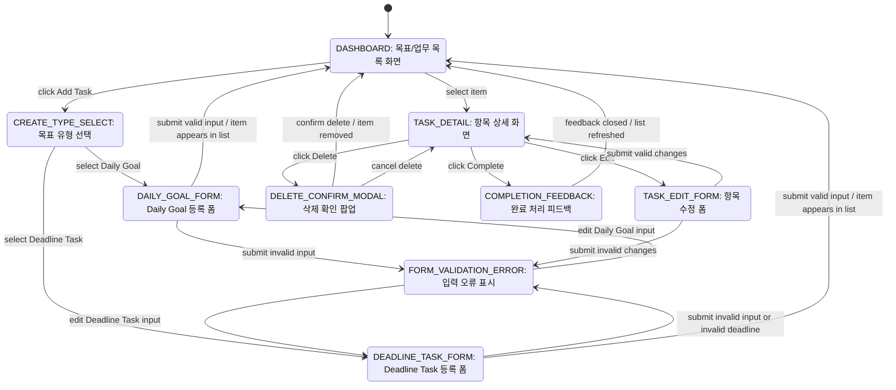
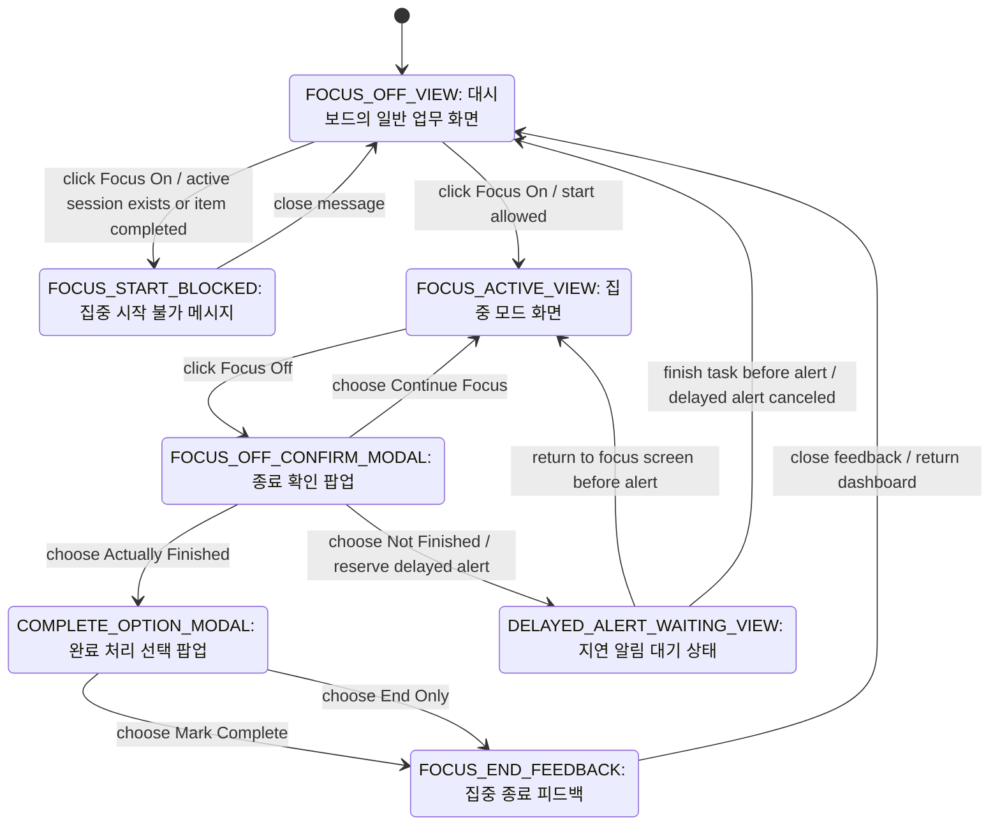
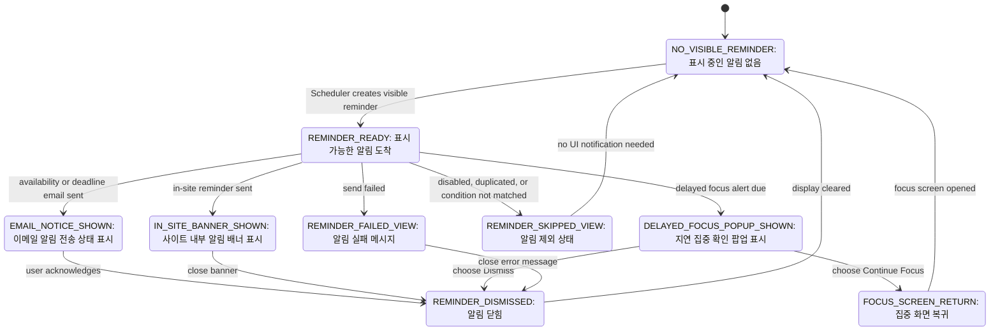
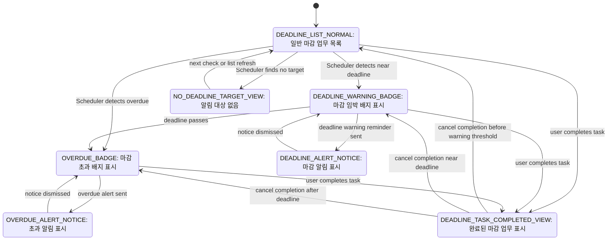
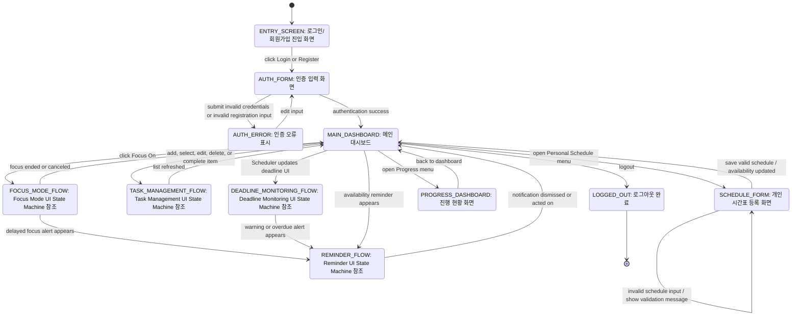

# SURF the TAsk UI Layer State Machine Diagram

**Source:** `images/ClassDiagram.png`, `docs/Class_Object_Sequence_Diagrams_22212069_박성준.md`  
**Purpose:** Class Diagram과 Sequence Diagram의 기능 흐름을 UI 상태와 사용자 이벤트 기준으로 재구성한 State Machine Diagram  
**Last Update:** 2026-06-05

---

## 작성 기준

- 사용자가 직접 보거나 조작하는 화면, 폼, 팝업, 배너, 알림 표시 상태를 기준으로 작성한다.
- 전이 이벤트는 버튼 클릭, 폼 제출, 검증 결과, Scheduler 알림 도착처럼 UI에서 관찰 가능한 사건으로 표현한다.
- Repository, Database, 내부 엔티티 저장 과정은 생략한다.
- Task Management, Focus Mode, Reminder, Deadline Monitoring의 하위 상태 머신과 전체 서비스 UI 상태 머신으로 구성한다.

---

## 1. Task Management UI State Machine

업무/목표 관리는 대시보드에서 시작한다. 사용자는 Daily Goal 또는 Deadline Task 등록 폼으로 이동할 수 있고, 등록된 항목은 목록, 상세, 수정, 삭제 확인, 완료 처리 UI를 통해 관리된다.

### Task Management UI 전이 요약

| 현재 UI 상태 | 사용자/시스템 이벤트 | 다음 UI 상태 | 관련 Use Case |
|---|---|---|---|
| DASHBOARD | Add Task 클릭 | CREATE_TYPE_SELECT | UC-04, UC-05 |
| CREATE_TYPE_SELECT | Daily Goal 선택 | DAILY_GOAL_FORM | UC-04 |
| CREATE_TYPE_SELECT | Deadline Task 선택 | DEADLINE_TASK_FORM | UC-05 |
| DAILY_GOAL_FORM, DEADLINE_TASK_FORM | 유효하지 않은 입력 제출 | FORM_VALIDATION_ERROR | UC-04-E1, UC-05-E1 |
| DAILY_GOAL_FORM, DEADLINE_TASK_FORM | 유효한 입력 제출 | DASHBOARD | UC-04, UC-05 |
| DASHBOARD | 항목 선택 | TASK_DETAIL | UC-07, UC-08 |
| TASK_DETAIL | Edit 클릭 | TASK_EDIT_FORM | UC-07 |
| TASK_DETAIL | Delete 클릭 | DELETE_CONFIRM_MODAL | UC-08 |
| TASK_DETAIL | Complete 클릭 | COMPLETION_FEEDBACK | UC-06 |

---

## 2. Focus Mode UI State Machine

Focus Mode UI는 대시보드에서 특정 항목의 Focus On을 선택할 때 시작된다. 사용자는 집중 모드 화면에서 Focus Off를 누르고, 실제 종료 여부 확인 팝업에서 완료 처리 여부를 선택한다.

### Focus Mode UI 전이 요약

| 현재 UI 상태 | 사용자/시스템 이벤트 | 다음 UI 상태 | 관련 Use Case |
|---|---|---|---|
| FOCUS_OFF_VIEW | Focus On 클릭 및 시작 가능 | FOCUS_ACTIVE_VIEW | UC-09 |
| FOCUS_OFF_VIEW | Focus On 클릭 실패 | FOCUS_START_BLOCKED | UC-09-E1, UC-09-E2 |
| FOCUS_ACTIVE_VIEW | Focus Off 클릭 | FOCUS_OFF_CONFIRM_MODAL | UC-10 |
| FOCUS_OFF_CONFIRM_MODAL | 계속 집중 선택 | FOCUS_ACTIVE_VIEW | UC-10-E1 |
| FOCUS_OFF_CONFIRM_MODAL | 실제 종료 선택 | COMPLETE_OPTION_MODAL | UC-10 |
| FOCUS_OFF_CONFIRM_MODAL | 아직 종료 아님 선택 | DELAYED_ALERT_WAITING_VIEW | UC-10-E1 |
| COMPLETE_OPTION_MODAL | 완료 처리 또는 종료만 선택 | FOCUS_END_FEEDBACK | UC-10, UC-10-E2 |
| DELAYED_ALERT_WAITING_VIEW | 작업 완료 또는 세션 종료 | FOCUS_OFF_VIEW | UC-15-E2 |

---

## 3. Reminder UI State Machine

Reminder UI는 시스템이 생성한 알림을 사용자가 확인할 수 있는 화면 상태로 표현한다. 가용 시간 알림, 마감 경고, 마감 초과 알림, 지연 In-site 알림은 모두 알림 배너 또는 팝업 표시 흐름을 공유한다.

### Reminder UI 전이 요약

| 현재 UI 상태 | 사용자/시스템 이벤트 | 다음 UI 상태 | 관련 Use Case |
|---|---|---|---|
| NO_VISIBLE_REMINDER | 표시 가능한 알림 도착 | REMINDER_READY | UC-13, UC-14, UC-15 |
| REMINDER_READY | 이메일 알림 전송 성공 | EMAIL_NOTICE_SHOWN | UC-13, UC-14 |
| REMINDER_READY | 사이트 내부 알림 전송 성공 | IN_SITE_BANNER_SHOWN | UC-15 |
| REMINDER_READY | 지연 집중 알림 도착 | DELAYED_FOCUS_POPUP_SHOWN | UC-15 |
| REMINDER_READY | 알림 제외 조건 발생 | REMINDER_SKIPPED_VIEW | UC-13-E1, UC-13-E2, UC-14-E1 |
| REMINDER_READY | 알림 전송 실패 | REMINDER_FAILED_VIEW | UC-13-E3, UC-14-E3, UC-15-E3 |
| DELAYED_FOCUS_POPUP_SHOWN | 계속 집중 선택 | FOCUS_SCREEN_RETURN | UC-15 |
| EMAIL_NOTICE_SHOWN, IN_SITE_BANNER_SHOWN, REMINDER_FAILED_VIEW | 확인 또는 닫기 | REMINDER_DISMISSED | UC-13, UC-14, UC-15 |

---

## 4. Deadline Monitoring UI State Machine

마감 업무 UI는 Scheduler의 판정 결과를 목록 화면의 배지, 강조 표시, 알림 표시로 보여준다. 마감 상태 자체는 내부 계산 결과이지만, UI 계층에서는 정상, 마감 임박, 마감 초과, 완료, 알림 표시 상태로 나타난다.

### Deadline Monitoring UI 전이 요약

| 현재 UI 상태 | 사용자/시스템 이벤트 | 다음 UI 상태 | 관련 Use Case |
|---|---|---|---|
| DEADLINE_LIST_NORMAL | 마감 임박 감지 | DEADLINE_WARNING_BADGE | UC-14 |
| DEADLINE_LIST_NORMAL, DEADLINE_WARNING_BADGE | 마감 초과 감지 | OVERDUE_BADGE | UC-14-E2 |
| DEADLINE_WARNING_BADGE | 마감 경고 알림 전송 | DEADLINE_ALERT_NOTICE | UC-14 |
| OVERDUE_BADGE | 마감 초과 알림 전송 | OVERDUE_ALERT_NOTICE | UC-14-E2 |
| DEADLINE_LIST_NORMAL, DEADLINE_WARNING_BADGE, OVERDUE_BADGE | 사용자가 완료 처리 | DEADLINE_TASK_COMPLETED_VIEW | UC-06 |
| DEADLINE_TASK_COMPLETED_VIEW | 완료 취소 | 현재 시각 기준 목록 상태 | UC-06-E2 |
| DEADLINE_LIST_NORMAL | 마감 알림 대상 없음 | NO_DEADLINE_TARGET_VIEW | UC-14-E1 |

---

## 5. Overall Service UI State Machine

전체 서비스 UI 상태 머신은 앞의 4개 UI 상태 머신을 하위 흐름으로 참조한다. 사용자는 로그인 후 대시보드에 진입하고, 시간표 등록, 업무 관리, 집중 모드, 알림 확인, 진행 현황 확인을 오가며 서비스를 사용한다.

### 전체 서비스 UI 전이 요약

| 현재 UI 상태 | 사용자/시스템 이벤트 | 다음 UI 상태 | 참조 상태 머신 |
|---|---|---|---|
| ENTRY_SCREEN | Login 또는 Register 클릭 | AUTH_FORM | - |
| AUTH_FORM | 인증 성공 | MAIN_DASHBOARD | - |
| AUTH_FORM | 인증 실패 또는 입력 오류 | AUTH_ERROR | - |
| MAIN_DASHBOARD | 개인 시간표 메뉴 진입 | SCHEDULE_FORM | - |
| MAIN_DASHBOARD | 업무 추가/선택/수정/삭제/완료 | TASK_MANAGEMENT_FLOW | Task Management UI State Machine |
| MAIN_DASHBOARD | Focus On 클릭 | FOCUS_MODE_FLOW | Focus Mode UI State Machine |
| FOCUS_MODE_FLOW | 지연 집중 알림 표시 | REMINDER_FLOW | Reminder UI State Machine |
| MAIN_DASHBOARD | Scheduler가 마감 UI 갱신 | DEADLINE_MONITORING_FLOW | Deadline Monitoring UI State Machine |
| DEADLINE_MONITORING_FLOW | 마감 경고 또는 초과 알림 표시 | REMINDER_FLOW | Reminder UI State Machine |
| MAIN_DASHBOARD | 가용 시간 알림 표시 | REMINDER_FLOW | Reminder UI State Machine |
| MAIN_DASHBOARD | 진행 현황 메뉴 진입 | PROGRESS_DASHBOARD | - |
| MAIN_DASHBOARD | 로그아웃 | LOGGED_OUT | - |

---

## 6. State Transition Coverage

| 관련 Use Case | 반영된 UI 상태 머신 | 주요 UI 상태 |
|---|---|---|
| UC-01 Register | Overall Service UI | ENTRY_SCREEN, AUTH_FORM, AUTH_ERROR, MAIN_DASHBOARD |
| UC-02 Log In | Overall Service UI | AUTH_FORM, AUTH_ERROR, MAIN_DASHBOARD, LOGGED_OUT |
| UC-03 Register Personal Schedule | Overall Service UI | SCHEDULE_FORM, MAIN_DASHBOARD |
| UC-04 Register Daily Goal | Task Management UI | CREATE_TYPE_SELECT, DAILY_GOAL_FORM, DASHBOARD |
| UC-05 Register Deadline Task | Task Management UI, Deadline Monitoring UI | DEADLINE_TASK_FORM, DEADLINE_LIST_NORMAL |
| UC-06 Check Task Completion | Task Management UI, Deadline Monitoring UI | TASK_DETAIL, COMPLETION_FEEDBACK, DEADLINE_TASK_COMPLETED_VIEW |
| UC-07 Edit Item | Task Management UI | TASK_DETAIL, TASK_EDIT_FORM, FORM_VALIDATION_ERROR |
| UC-08 Delete Item | Task Management UI | TASK_DETAIL, DELETE_CONFIRM_MODAL, DASHBOARD |
| UC-09 Turn On Focus Mode | Focus Mode UI | FOCUS_OFF_VIEW, FOCUS_ACTIVE_VIEW, FOCUS_START_BLOCKED |
| UC-10 Turn Off Focus Mode | Focus Mode UI | FOCUS_OFF_CONFIRM_MODAL, COMPLETE_OPTION_MODAL, FOCUS_END_FEEDBACK |
| UC-11 Prioritize Tasks | Task Management UI, Overall Service UI | DASHBOARD, MAIN_DASHBOARD |
| UC-12 Review Progress | Overall Service UI | PROGRESS_DASHBOARD |
| UC-13 Send Availability-based Reminder | Reminder UI, Overall Service UI | REMINDER_READY, EMAIL_NOTICE_SHOWN, REMINDER_SKIPPED_VIEW |
| UC-14 Send Deadline Warning / Overdue Alert | Deadline Monitoring UI, Reminder UI | DEADLINE_WARNING_BADGE, OVERDUE_BADGE, DEADLINE_ALERT_NOTICE |
| UC-15 Send Delayed In-site Alert | Focus Mode UI, Reminder UI | DELAYED_ALERT_WAITING_VIEW, DELAYED_FOCUS_POPUP_SHOWN |
